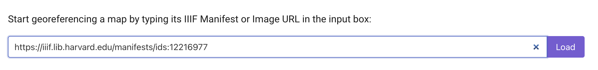

# How to georeference images in the HMC digital collections

1. Find the map you would like to work with in the [Harvard Libraries Digital Collections](https://library.harvard.edu/digital-collections)
> Filter results by selecting `Type: Map` or `Repository: Map Coll (Pusey)`

2. In the top-right corner of the image viewer, select the metadata Tooltip by clicking the `i` icon.

3. Scroll to the bottom of the popup window and under `Links → Manifest`, copy the manifest URL.
> Example: https://iiif.lib.harvard.edu/manifests/ids:12216977
> If you are working with a multi-page book, or otherwise need help finding the manifest URL, contact us at _maps@harvard.edu_.

4. Navigate to the [AllMaps.org Editor](https://editor.allmaps.org/#/)
> AllMaps is a free, open-source software for georeferencing maps in the browser. It supports the [IIIF framework](https://iiif.io/).

5. Paste the map's IIIF manifest URL into the input box and select `Load`. 

6. Use the `mask` tab to crop out marginalia, if necessary, and the `georeference` tab to assign control points between the map on the left, and the baselayer on the right. Start with at least three control points, evenly distributed at equidistant spots around the map. You can add a few more, for more specificity. Click the `results` tab to check the results. 

7. Copy the manifest URL again, if you don't already have it save to your clipboard. 

8. Navigate to the [AllMaps tile server info page](https://observablehq.com/@bertspaan/allmaps-tile-server). Drop the manifest URL in the `IIIF Manifest or Image URI` input box.

9. Click submit. Scroll down to make sure your map is appearing. You can adjust the opacity to make sure the georeferencing is lined up appropriately.

10. Scroll down to find the tile URL for your map. You can use this link in any mapping software that accepts map tiles as a data source. In this tutorial we will show how to add the map to a QGIS project. Copy the tile link.

11. Open QGIS. If you need to download the free desktop software, learn how to do so [here](https://harvardmapcollection.github.io/tutorials/qgis/download/).

12. Open a new project.

13. In the `Browser` window, under `XYZ Tiles` drag `OpenStreetMap` into the map canvas window.

14. In the `Browser` window, right-click `XYZ Tiles` and select `New Connection`.

15. Name your map, and paste in tile URL you copied from step 10. Select `OK`. 

16. In the `Browser` window, under `XYZ Tiles`, double-click the new connection item you just created to add it to the map. 

17. Zoom in to your area of interest using the zoom controls in the banner menu across the top of the program. As you zoom in, your georeferenced map should appear. 
> Tip: it may take a second for the quality of the tiles to resolve.

18. To adjust opacity of your map, right-click the map layer in the `Layer list` and select `Properties`.

19. Under the `Legend` tab in the `Properties` menu, highlight `Opacity Slider` and use the right-pointing arrow to move the widget from `Available widgets` to `Used Widgets`. 

20. Select `OK`. There should now be an opacity control under the map layer item in the `Layer list`.

