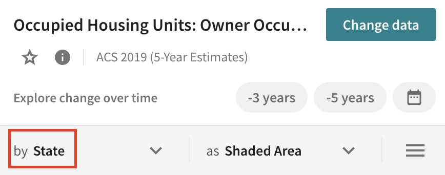
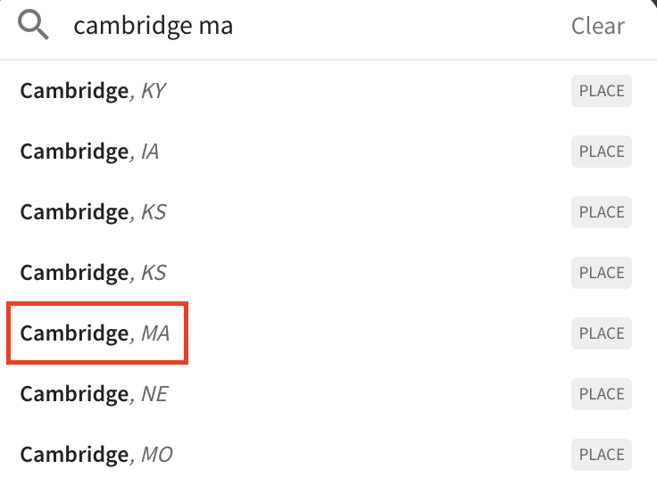

# How to explore census data online with Social Explorer

This tutorial will walk through the following [Social Explorer](http://nrs.harvard.edu/urn-3:hul.eresource:socialex) tasks:
- Changing the map by picking a demographic variable
- Adding or uploading additional datasets for comparison
- Exporting census visualizations as rendered map .png files

>**Tip:** [Censusreporter.org](https://censusreporter.org/) is a tool for learning which census variables are available, and how they are collected.

## Example use case 

This tutorial will practice exploring data based on the following parameters:
- **Topic:** The `tenure` variable, which looks at owner vs. renter-occupied units.
- **Geographic Level:** Census responses that have been aggregated to the **census tract** level.
- **Location:** Near the Harvard campus, in Somerville and Cambridge. 
- **Year:** The most recent [estimates](https://www.census.gov/programs-surveys/acs/guidance/estimates.html) at the time this guide was written, 2015-2019.

## Getting started with Social Explorer

1. Visit your institution's Social Explorer. Here is the [link for Harvard's Social Explorer](http://nrs.harvard.edu/urn-3:hul.eresource:socialex).

2. If you have an account, log in. Otherwise, you'll have to make one.

## Changing demographic variables

1. Select `Change data`.

2. Select `Housing`.

2. Select `Owner Occupied` under `ACS 2019 (5-Year Estimates) → Tenure → Occupied Housing Units`.

4. Select the **close button** at the top of the data selector menu.

5. Select the `by State ` to open the Geography selector.

6. Select `Census Tract`.

7. In the search bar, search for Cambridge, MA.

8. Zoom in and out of the map to explore in more detail.

## Adding or uploading datasets

1. Select the ☰ icon from the **change data** menu to see options for adding other datasets.

2. Select `Map Layers`.

3. Choose between browsing the `Layer library` for prepared datasets, or select `Upload data` to import your own .CSV file of addresses.

> Social Explorer has guides and [documentation on how to upload your data layer](https://www.socialexplorer.com/help/using-maps/working-with-your-data/upload-your-data).

## Exporting the data as a map image

1. Select the `Export as Image` button from the top-right menu banner.

2. Define the extent by zooming and panning.

3. Select `Export` and the image file will download to your computer.

