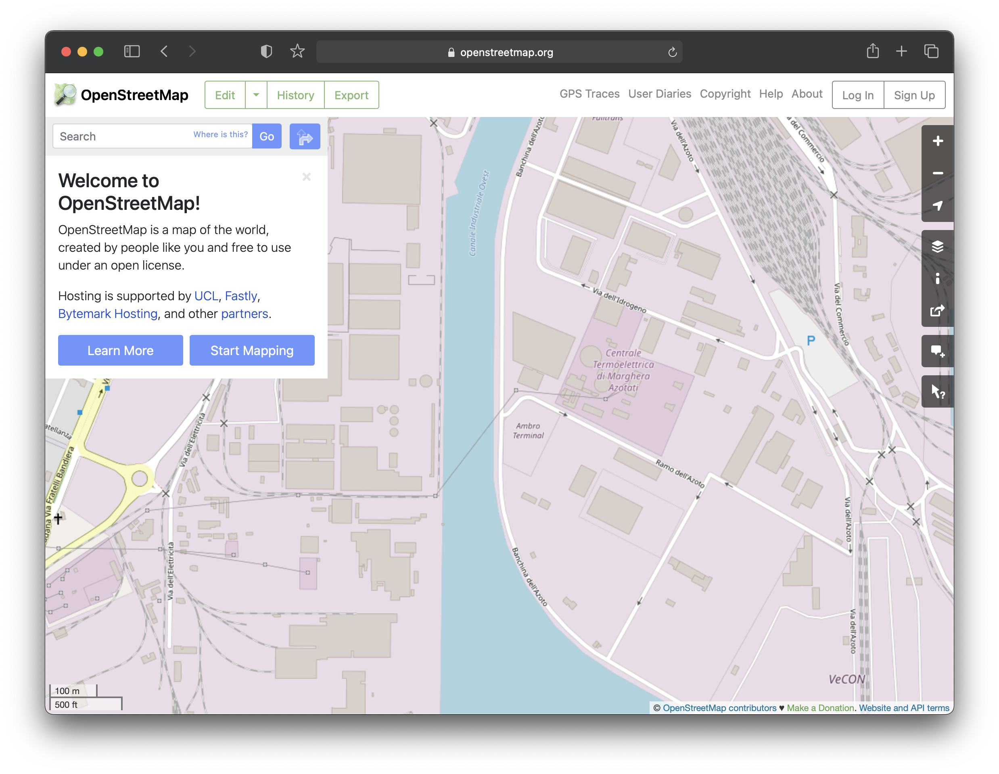

# Extracting OpenStreetMap Data Layers

As a GIS user, you may encounter scenarios where data about a place's built and natural environment is challenging to find.

Depending on the administrative resources of the place you are studying, GIS data may be more or less available for that place. 

[OpenStreetMap (OSM)](https://www.openstreetmap.org/#map=12/45.4284/12.2597) can sometimes be a solution to that problem -- with some important caveats. 

This tutorial will explain:
1. What OpenStreetMap data is
2. When you should and shouldn't use it
3. How to go about downloading the data

## What is OpenStreetMap?

[OpenStreetMap (OSM)](https://www.openstreetmap.org/#map=12/45.4284/12.2597) is a mapping tool powered by *crowd-contributed* data. You can think of OSM as the Wikipedia of GIS mapping -- you can usually find decent geospatial information about most locations here, but should bring the same level of healthy skepticism you would approach a Wikipedia article with. 

OpenStreetMap allows users all over the world to add or edit data features about a place. You can also download this information, and use it in any spatial software which supports [common GIS file formats](https://sites.udel.edu/gis/file-formats-for-gis/) (shapefiles, geoJSON, etc.).

Using OSM data extracts can be a great way to find data about the roads, rivers, trails, buildings, and other features of a place, when you are having a hard time finding official datasets created and published by administrative managers of that place. 

## When is it appropriate to use OpenStreetMap data?
Because the data is crowd-contributed, if you are doing serious research and it is absolutely integral to your project to have verifiable data sources, replete with sound data collection methodology, you should *not* use OpenStreetMap data. 

Alternatively, if you are looking for some quick baselayers to get your project started, or to get a rough visual sense of a place, extracting data from OpenStreetLayers is a great option.

## Step-by-step guide to downloading OSM data 

1. **Visit [GeoFabrik](https://download.geofabrik.de/)**, a tool providing OSM data which is updated on a daily basis.

    *Remember, this data is crowd-contributed, so it changes every day.*

2. **Select the appropriate `sub-region`**.

    For this particular example, we are searching for data for Venice, Italy, so we will select `Europe`.

3. **Select the additional `sub-region`**.

    Venice is in the Northeast of Italy, so we will select `Nord-Est`. 

### Tip
If you hover over the available sub-regions, the map will preview the extract extent.

4. To use this data in a typical desktop GIS environment such as `ArcGIS Pro` or `QGIS`, **select the `.shp.zip`** quick link. This will download the data to your computer. 

    The data comes downloaded in multiple layers, each representing a different kind of data. For instance, you will find:
    * waterways
    * transport
    * places
    * land use
    * buildings

    Each of these layers is available as a [shapefile](https://cartinal.leventhalmap.org/guides/file-formats.html#shapefile) you can use in the GIS software.

Also included in the download is a `README` file, which links out to documentation. In the documentation, you can read the data attributes and understand how to interpret the data. 

The documentation is availble as [a PDF, OpenStreetMap Data in Layered GIS Data Format](http://download.geofabrik.de/osm-data-in-gis-formats-free.pdf).

