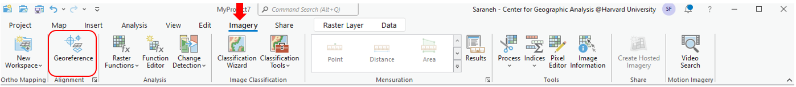
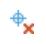

# How to Georeference in ArcGIS PRO

1. Open a new map 
 in ArcGIS Pro and select the basemap  of your choice `Map → Basemap → Open Street Map` 

2. **Set the projection** by right clicking the basemap in the *Contents* pane and select **Properties** `Properties → Coordinate Systems`

3. Open the image which needs to be georeferenced `Catalog → Folders → Add Folder Connection `
> Right click on 'Folders' and navigate to the folder containing the map that needs to be georeferenced. Press 'OK' to add the folder as a connection.

4. Drag the image from the 'Catalog' pane, into the 'Map' pane
> Select 'OK' to 'Build Pyramids and Calculate Statistics'

5. Open the georeferencing toolbar `Imagery → Georeference`

6. Now it is time to add control points. `Georeference → Add Control Points` 
> Adding control points creates a link between a real geographic location and a location present in the map image.
- Find a recognizable geographic location on the map image and click on it to add the first control point, thus creating Link 1.
    * For example, in a map of New York, you could use the tip of Manhattan as a control point. 
- Now, we want to link this control point to an actual lat/long value.
    * right click on the **basemap** in the 'Contents' pane and select 'Zoom to Layer' to bring it into view.
    * Once you have found the same location on the basemap, simply click to add the corresponding control point, completing Link 1.
- Use the "Locate" tool in the upper left hand corner of the Georeferencing toolbar to help you find places. 
    * For example, search "Manhattan" or "Manhattan, New York", and it will locate Manhattan on the basemap for you!
    * You can also type in XY coordinates into the Locate tool

7. Continue to add two more control points, so that there are three control points in total.
> Switch between the image and the basemap by right clicking on the layer in the 'Contents' pane and selecting 'Zoom to Layer'.
* Control points can be added  or deleted  using the options available in the georeferencing toolbar. 
* Select "Control Point Table" to see a table of links you have made.
    - Here, you can also add and delete control points, and even alter their geographic coordinates directly from within this table.

8. Now that the control points are completed, we are able to transform the map. `Georeference → Transformation → Similarity Polynomial`

9. Your image has been georeferenced! 

