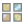
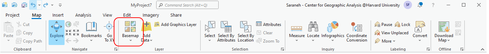
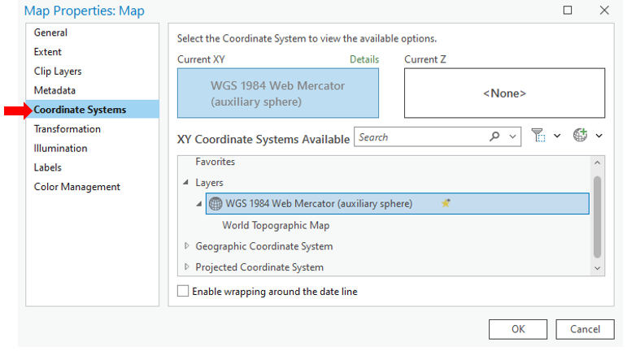
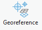
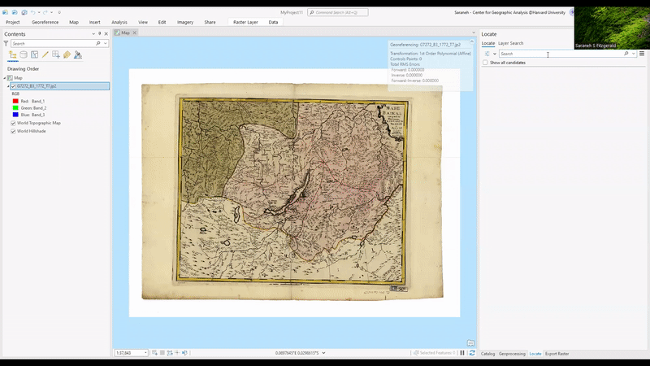
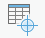
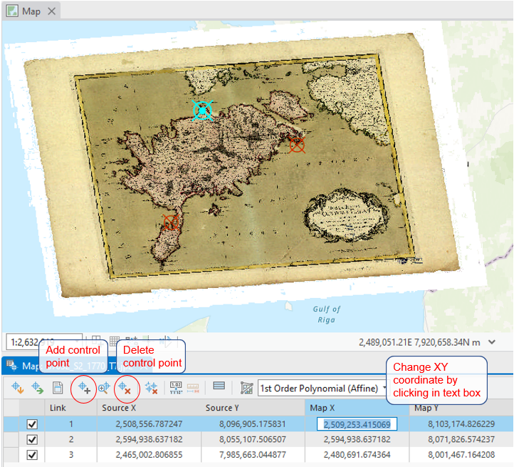

# How to Georeference in ArcGIS PRO

1. Start up ArcGIS Pro
    > If you do not have it installed yet, [this guide](https://gis.harvard.edu/arcgis-pro) created by the Harvard Center for Geographic Analysis will walk you through the installation process.

2. Open a new map 
 in ArcGIS Pro and select the basemap  of your choice `Map → Basemap → Open Street Map` 

3. **Set the projection** by right clicking the basemap in the *Contents* pane and select **Properties** `Properties → Coordinate Systems`

4. Open the image which needs to be georeferenced `Catalog → Folders → Add Folder Connection `
    * Right click on 'Folders' and navigate to the folder containing the map that needs to be georeferenced. Press 'OK' to add the folder as a connection.

5. Drag the image from the 'Catalog' pane, into the 'Map' pane
    * Select 'OK' to 'Build Pyramids and Calculate Statistics'

6. Open the georeferencing toolbar `Imagery → Georeference`

7. Add control points. `Georeference → Add Control Points` 
    * Adding control points creates a link between a pixel in the map image and an actual XY coordinate.
    * Find a recognizable geographic location on the **map image** and click on it to add the first control point, thus creating Link 1. 
        * Next, right click on the basemap in the 'Contents' pane and select 'Zoom to Layer' to bring it into view.
        * Click on the corresponding location in the **basemap** in order to complete Link 1. 
        
        > Tip: Use the "Locate" tool in the upper left hand corner of the Georeferencing toolbar to help you find places. 
        > *For example, search "Manhattan" or "Manhattan, New York", and it will locate Manhattan on the basemap for you!*
        > *You can also type in XY coordinates into the Locate tool*

8. Continue to add two more control points, so that there are three control points in total.
    > Switch between the image and the basemap by right clicking on the layer in the 'Contents' pane and selecting 'Zoom to Layer'.
    * Control points can be added  or deleted  using the options available in the georeferencing toolbar. 
    * Select "Control Point Table" to see a table of links you have made.
        - Here, you can also add and delete control points, and even alter their geographic coordinates directly from within this table.

9. Now that the control points are completed, we are able to transform the map. `Georeference → Transformation → Similarity Polynomial`

10. Your image has been georeferenced! 

> Continue to [this guide](https://harvardmapcollection.github.io/tutorials/agol/tile-layer
) to learn how to upload a georeferenced map to ArcGIS Online
