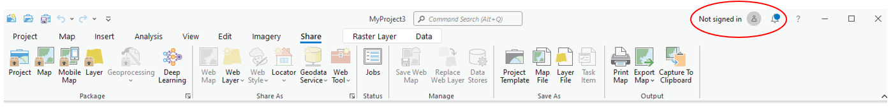
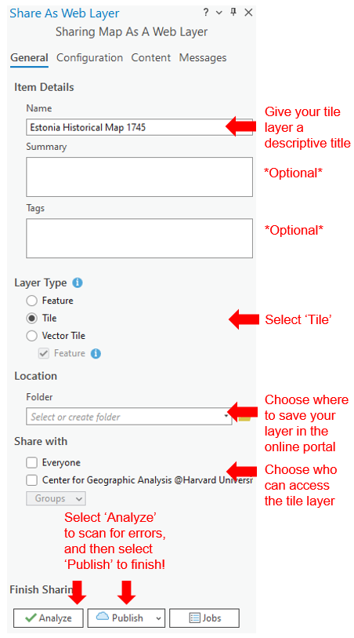

# How to Share a Web Tile Layer

1. Open ArcGIS Pro and log into your ArcGIS Online account in the upper right hand corner 

2. With the georeferenced map opened in the Map viewer, go to 'Share as Web Layer' `Share as → Web Layer → Publish Web Layer` 

3. Fill out the fields in the "Share as Web Layer" pane as follows: 

4. Press Publish and your tile layer can now be viewed in ArcGIS Online!
