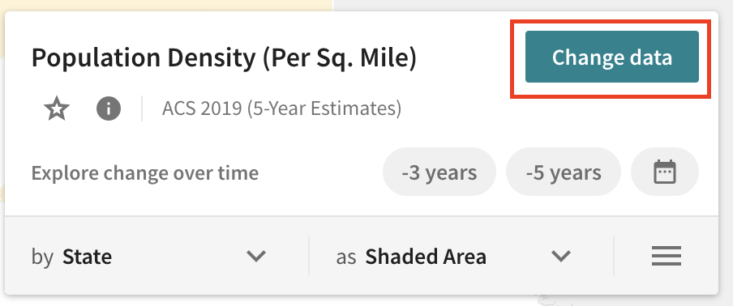
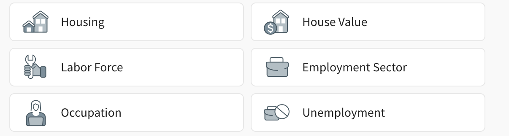
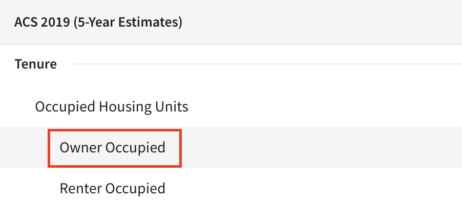

# How to Preview Census Data Using Social Explorer

In this tutorial, you will learn:
- How to preview U.S. census data using [Social Explorer](http://nrs.harvard.edu/urn-3:hul.eresource:socialex)
- How to filter all census data by a demographic variable of interest
- How to add or upload datasets
- How to export the data as a rendered .png format map

>**Tip:** [Censusreporter.org](https://censusreporter.org/) is a tool for learning which census variables are available, and how they are collected.

## Example use case 
- We will be exploring `tenure` data, which looks at owner vs. renter-occupied units.
- We want to preview census responses that have been aggregated to the **census tract** level.
- Our area of study is near the Harvard campus, in Somerville and Cambridge. 
- We'll be looking at the most recent [estimates](https://www.census.gov/programs-surveys/acs/guidance/estimates.html) at the time this guide was written, 2015-2019.

## Getting started with Social Explorer

1. Visit your institution's Social Explorer. Here is the [link for Harvard's Social Explorer](http://nrs.harvard.edu/urn-3:hul.eresource:socialex).

2. If you don't already have an account, make one. Otherwise, log in. 

## Changing demographic variables

1. Choose `Change data`.

2. Choose `Housing`.

2. Select `Owner Occupied` under `ACS 2019 (5-Year Estimates) → Tenure → Occupied Housing Units`.

## Adding or uploading datasets

## Exporting the data as a map image