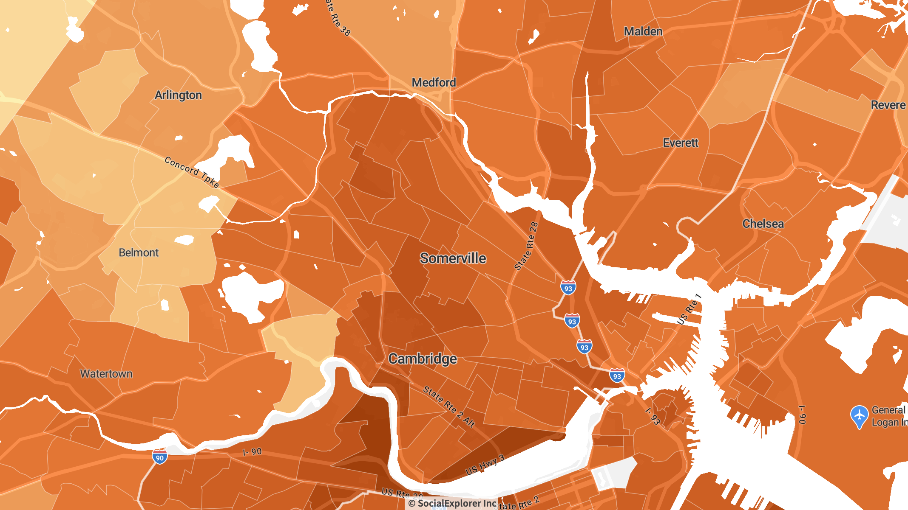
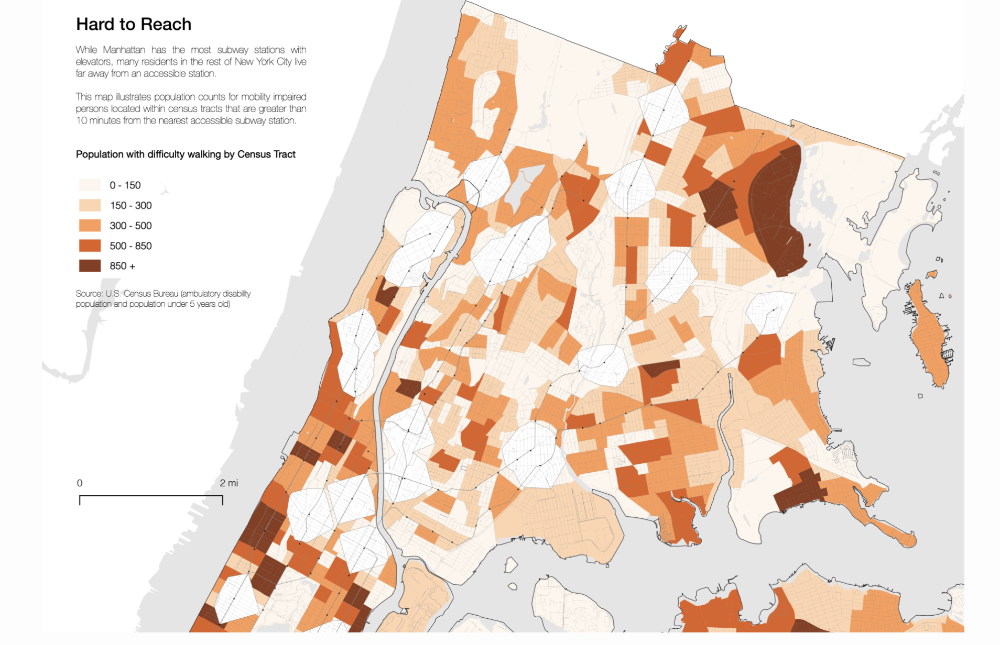

# Do I need to download census data?

Deciding whether you need to download and process geospatial data is a good first step for your mapping project.

There are many online visualization tools and streaming data services that allow you to explore popular GIS datasets, and even export rendered maps without having to download data.

To download and process data requires additional time and skill-building. Planning in advance whether you should budget this time and knowledge acquisition into your project will help you get more mileage out of what you can accomplish.

.

_Example of a map you can export from [Social Explorer](http://nrs.harvard.edu/urn-3:hul.eresource:socialex), a tool that lets you interactively explore census data. This map shows percent of people aged 18-34 in Somerville and Cambridge_

## Do I need data checklist

| **Use explore tools**     | **Probably need data** |
| ----------- | ----------- |
| Good explore tools exist for my dataset  | No explore tools exist      |
| Get a sense of the data quickly     | Want to dive deeper into the data      |
| No analysis needed   | Need to do analysis, combine, or edit the data       |
| No comparison with other datasets needed  | Want to compare with other datasets       |
| No custom map design needed | Want to control look of final map output   |

### Case study

Let's look at an example map using census data. Why did the cartographer need to download copies of the data to their computer in order to make this map?

#### Quick facts
- The map is about people in NYC who have impaired mobility.
- It argues that there should be more robust transit infrastructure to serve them.
- It uses a combination of _two_ census variables as well as transit data to make that argument.

_Map created from the [PointsUnknown tutorial series](https://pointsunknown.nyc/tutorial_list/), a great way to get started learning how to make maps._

#### Data download reason #1: Editing the data tables

The point of the map is that people need increased train services, such as additional stops and elevators within stations. To make that point, the cartographer wanted to show _who_ those people are, and where they live. The problem is, everyone who might have trouble walking to a train or need an elevator doesn't fit into one neat census category. To make this point, the cartographer needed to download _two_ census variables, `population with abulatory difficulties` _and_ `population under age 5`, and combine that data together using a program like Excel or Google Sheets. It is this new, combined column we see visualized as the orange-red gradient in the example map.

#### Data download reason #2: Performing analysis

To show that people live outside of train service areas, the cartographer used a GIS function called a **buffer**. Buffers measure distance outwards from a location. In the example map, a buffer is applied around the train stop locations measuring walking distance outward, so the cartographer can accentuate populated places where people need services. 

_[More about buffers](https://desktop.arcgis.com/en/arcmap/10.3/tools/analysis-toolbox/buffer.htm)._ 

Buffers are created using desktop GIS programs like ArcGIS Pro or QGIS. These programs have robust geospatial analysis capabilites. After generating the buffer layer, the cartographer draped it over the census data by arranging the datasets as layers.

_Layering concept explained by [NISL GIS](https://planet.uwc.ac.za/nisl/gis/tutorial/page_04.htm)._

#### Data download reason #3: Custom styling the map

All maps communicate something, whether the map maker is trying to, or not! [Being deliberate about styling choices](https://www.axismaps.com/guide) is how cartographers elevate the main arguments of the map. In the example, the cartographer makes many custom styling decisions. Cartographers apply styling to the data using programs such as ArcGIS or QGIS, or for more sophisticated cartography, Adobe Illustrator. 

_If you'd like to learn how to make the map in this example, you can follow [this map making tutorial](https://pointsunknown.nyc/qgis/2021/04/16/04A_Spatial_Analysis.html) from PointsUnknown._ 

