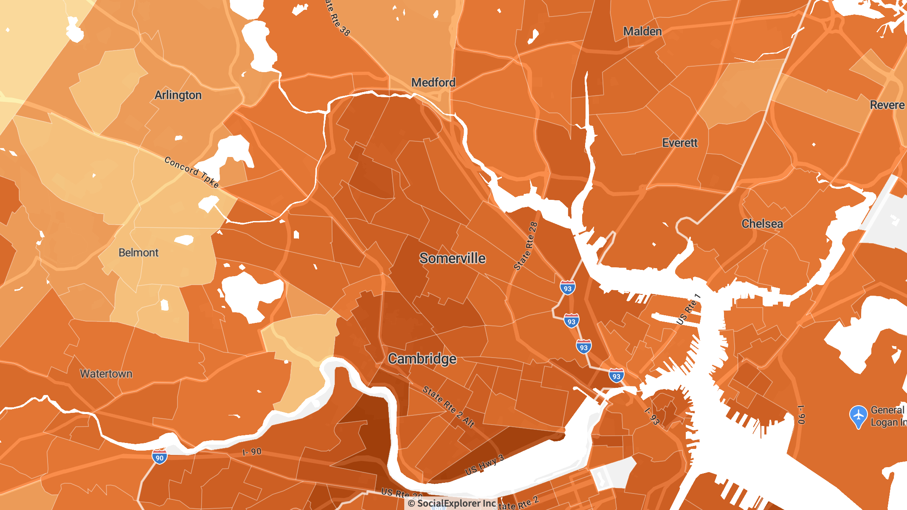
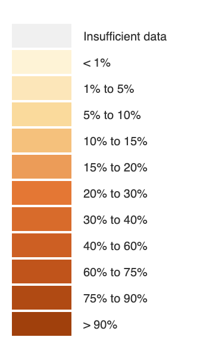
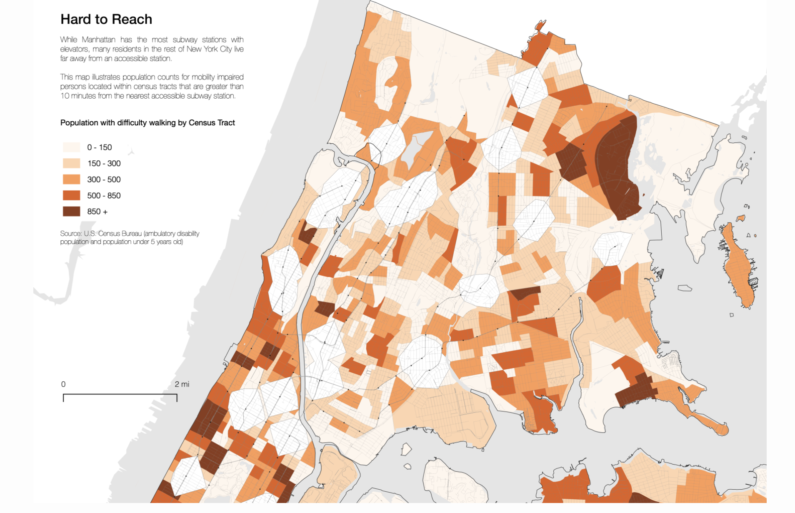
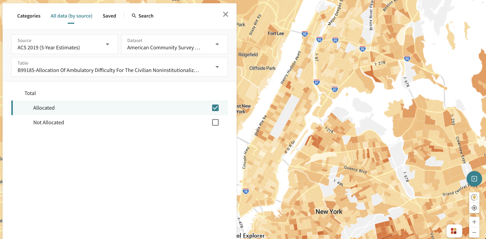
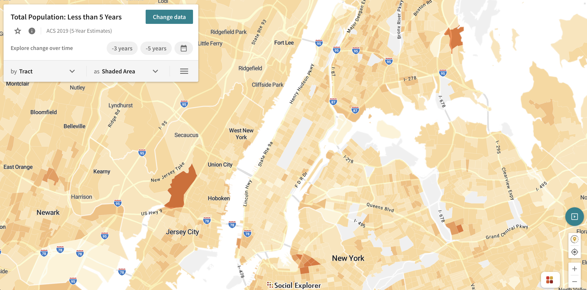

# How to Decide If I Need Geospatial Data

Deciding whether you need to download and process geospatial data is a good first step for your mapping project.

There are many online visualization tools and streaming data services that allow you to explore popular GIS datasets, and even export rendered maps without having to download data.

To download and process data requires additional time and skill-building. Knowing ahead of time whether you should budget this time and knowledge acquisition into your project is useful.

## Cheat sheet

### Times when explore tools will probably do the trick
- You want to get a better sense of the data, without spending time creating your own visualization
- You want to create a simple map displaying the data with no customization, comparison with other datasets, or analysis
- A good explore tool exists for the data you are studying, like in the case of [Social Explorer tool](http://nrs.harvard.edu/urn-3:hul.eresource:socialex) for US census data

_Example of rendered map materials auto-exported from Social Explorer, showing percent of people aged 18-34 in Somerville and Cambridge_

### Times when you will probably need to download and process geospatial data

- You want your visualization to be more customized than what is available in the exploration tool. Some examples include:
    - editing the dataset's geography to lend focus to a specific place
    - styling the data in Adobe Illustrator or [QGIS](https://harvardmapcollection.github.io/tutorials/qgis/download/) to have more control over your map's look and feel 
- You need to perform some sort of math or analysis on the data "under the hood" prior to creating the visualization. Some examples include:
    - tallying or combining multiple fields 
    - overlaying and comparing with different datasets to understand the impact of a certain factor

### Example 

_Map created from the [PointsUnknown tutorial series](https://pointsunknown.nyc/qgis/2021/04/16/04A_Spatial_Analysis.html), a great way to get started learning how to make maps._

In the map above, which makes the case for increased tranportation amenities for those with impaired mobility, the cartographer needed to download geospatial data. We will go over some of the reasons why.

#### Reason #1: Editing the data tables

For the demographic data, which, in this map appears as the orange-red gradient, the cartographer wanted to show all people who might require specific transit infrastructure, such as elevators. This means they needed to _combine_ population statistics from two census tables and put them on one map: `population with abulatory difficulties` _and_ `population under age 5`.

If this cartographer had been using a tool like Social Explorer to generate their maps, rather than downloading and editing the datasets on their desktop, they would have had to export prerendered maps of each demographic separately, which would have looked like this:

_Map showing ambulatory difficulty for census tracts in NYC._

_Map showing population under age 5 for census tracts in NYC._

By downloading the data tables, they were able to do some math in Excel to tally up the demographic statistics into one mappable column. 

#### Reason #2: Performing analysis

The second reason this cartographer needed to download the data, is because they wanted to make a point about places where there were large pockets of mobility-impaired citizens over a ten-minute walking distance from a train station. This required using both datasets together with analysis tools to create the distance buffers. 

#### Reason #3: Custom styling the map

Finally, this cartographer did some custom styling, which allowed them to communicate their argument, or story more effectively than the boilerplate exports from Social Explorer would have.

You can learn how to do each of these steps by following [the tutorial for creating this map](https://pointsunknown.nyc/qgis/2021/04/16/04A_Spatial_Analysis.html) from PointsUnknown. 

