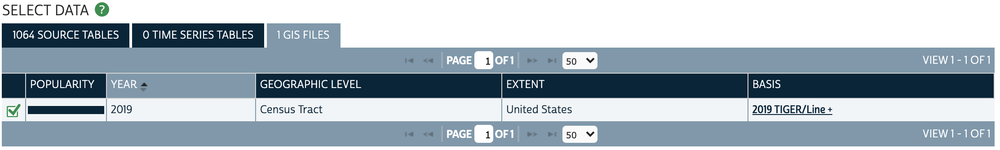

# How to Download Census Boundary Files

## Where to download data

Tabular statistical data and spatial geography files are available for download on both the official [Census Bureau's website](https://www.census.gov/en.html), *and* [NHGIS.org](https://www.nhgis.org/), a census data repository designed specifically for GIS and research purposes.

Both websites are popular options for downloading census data in GIS formats. People tend to use one or the other based on personal preferences.

This guide will walk through how to obtain 2019 census tract GIS files from either website.

### NHGIS.ORG

1. Navigate to [nhgis.org](https://www.nhgis.org/).

2. Click `Get Data`.

3. Use the facets on the left to filter by what you want
    - Under `GEOGRAPHIC LEVELS` select `Census Tract`
    - Under `YEARS` select `2019`

Because we have not selected a data *topic*, and instead have only filtered by year and geography, we are seeing over 1,000 statistical tables for different topics that are available at the tract level.

If we switch tabs from `SOURCE TABLES` to **`GIS FILES`** we see just one census tract GIS file. This is the file we want to download.

4. Click the tab that says `1 GIS FILES`.

5. Select the 2019 Census Tract file by clicking the checkbox.

6. Check out the data in your `Data Cart`. 

The first time you use NHGIS, you will need to create a free researcher account. 

It will take a few moments for your extract to prepare. You will receive an email when it is ready to download. You can check the status of an extract by clicking the `My Data` tab.

### CENSUS.GOV

1. Visit [census.gov](https://www.census.gov/en.html).

2. Hover over `Browse by Topic` and select `Geography`.

3. In the left-hand menu, select `Geographies`.

4. In the left-hand menu, select `Mapping Files`. 

5. Select the year you are interested in, in our case `2019`. 

6. Select `Cartographic Boundary Files`. 

7. Select `2019` again.

8. Scroll down to `Census Tracts`.

9. You can download tracts for the whole country, or download just for a single state.

