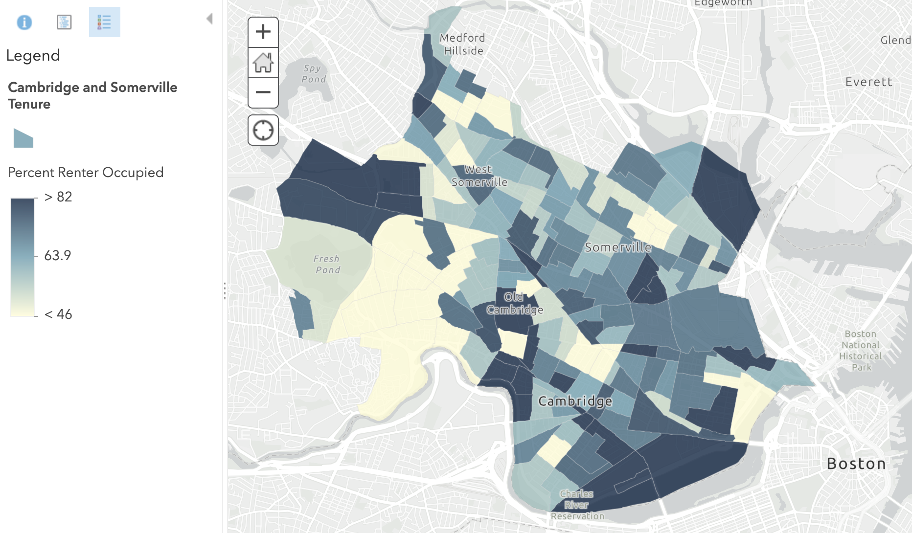
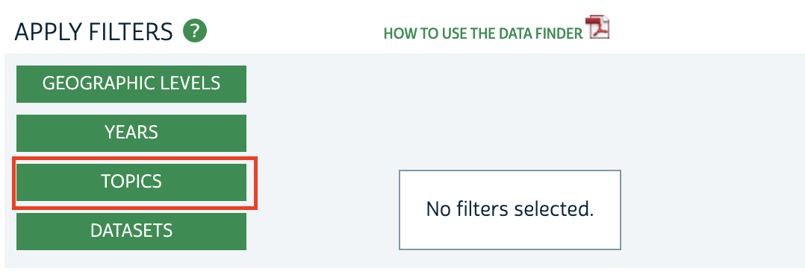
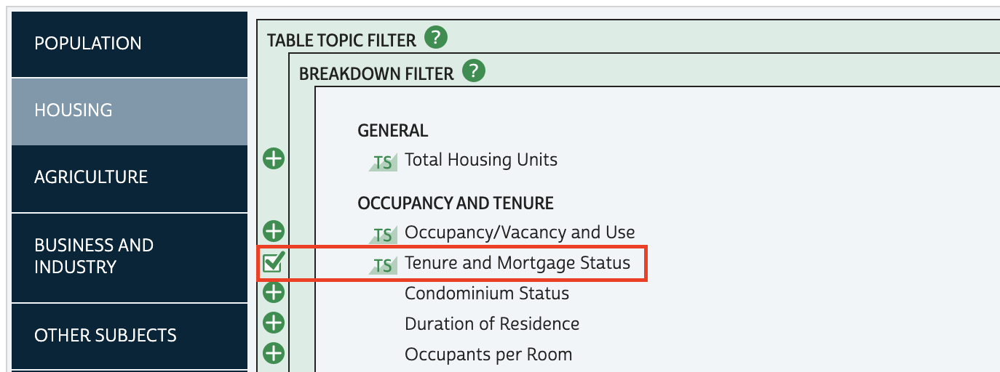
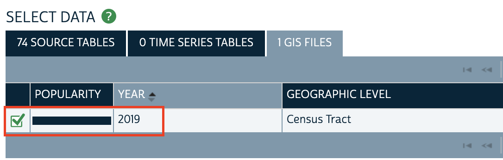
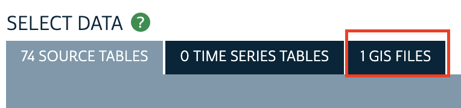

# How to Obtain Census Data for GIS Mapping

To make a map, you need to download two separate census files:
1. A table of statistics
2. A geography boundary file

## Example data 
- We will be exploring `tenure` data, which looks at owner vs. renter-occupied units.
- We want census responses that have been aggregated to the **census tract** level.
- Our area of study is near the Harvard campus, in Somerville and Cambridge. 
- We'll be looking at the most recent [estimates](https://www.census.gov/programs-surveys/acs/guidance/estimates.html) at the time this guide was written, 2015-2019.

> **Geography tip:** Census tracts are a popular aggregation unit, as they are more granular than county or state level data, but more available and statistically-reliable than block level data. 

The steps in this tutorial series will work for any U.S. census data, such as age, race, income, etc. If you're not sure which variables are available, you can use [censusreporter.org](https://censusreporter.org/) to find out.

_Example of the tenure data we will work with, uploaded to ArcGIS Online._

## Steps

1. Visit NHGIS.org.

2. Select `Get Data`.

3. Select `Topics`. 

4. Select `Housing`.

5. Check off `Tenure and Mortgage Status`.

6. Finalize your topics selection by choosing the `Submit` button.

7. To specify we want to work with census tracts, select `Geographic Levels`.

8. Check off `Census Tract`.

9. Finalize your geographic levels selection by choosing the `Submit` button.

10. To indicate our time frame of 2015-2019, select `Years`.

11. Check off `2015-2019`.

12. Finalize your years selection by choosing the `Submit` button.

13. Under `Source Tables`, check off the **Tenure** data table. This will add the census statistical table to our shopping cart.

14. To change the results that match our criteria from **tables** to **GIS boundary files**, select `GIS Files`.
>Remember, we need both!

15. Checkout by selecting `Continue` from the data cart in the upper-right hand corner of the screen.

16. Accept all of the download defaults.

17. Select `Submit`.
> You will need to create a free login in order to checkout. You can create one in a new tab if you don't want to lose your data selection.

You are now ready to move on to the next skill, [How to focus the data](https://harvardmapcollection.github.io/tutorials/qgis/clip).

## Tips

- It takes a few minutes to prepare your extract. You can either wait and refresh the page, or you will receive an email when the data is ready.
- Extracts come with any accompanying codebook.

- Use this codebook to make sense of the table's field names.

