# How to Obtain Census Data for GIS Mapping

Sometimes new mappers are tripped up by census data, because in order to make a map, you  need to download two separate census files:
1. A table of statistics
2. A geography boundary file

## Sources

In this lesson, you will learn how to get these files from your choice of the following sources.

### Social Explorer

- User-friendly
- Requires a license
- [Access Social Explorer via Harvard Key](http://nrs.harvard.edu/urn-3:hul.eresource:socialex)

### NHGIS.org
- Somewhat less intuitive
- No license required
- [Access NHGIS.org for free](nhgis.org)

Either choice will provide you with census data well-tailored for GIS methods. We recommend using one of these sources for digital mapping, as opposed to downloading directly from The U.S. Census Bureau portal.

## Example data 
- We will be exploring `tenure` data, which looks at owner vs. renter-occupied units.
- We want census responses that have been aggregated to the **census tract** level.
- Our area of study is near the Harvard campus, in Somerville and Cambridge. 
- We'll be looking at the most recent [estimates](https://www.census.gov/programs-surveys/acs/guidance/estimates.html) at the time this guide was written, 2015-2019.

> **Geography tip:** Census tracts are a popular aggregation unit, as they are more granular than county or state level data, but more available and statistically-reliable than block level data. 

The steps in this tutorial series will work for any U.S. census data, such as age, race, income, etc.

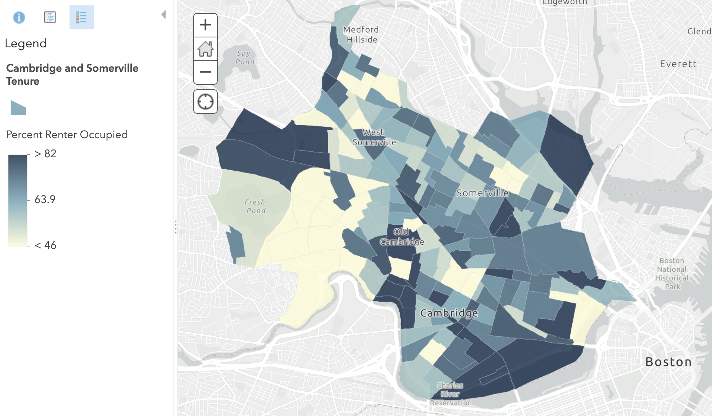
_Example of the tenure data we will work with, uploaded to ArcGIS Online._

## Do I need data?
Sometimes, you don't need to download census data in order to make use of it for your research. Many tools, like [Social Explorer](http://nrs.harvard.edu/urn-3:hul.eresource:socialex), allow you to visualize the data directly in the browser, and even export rendered maps.

To help decide if you need to budget time for learning how to download and manipulate geospatial data, check out our [How to Decide If I Need Geospatial Data](https://harvardmapcollection.github.io/tutorials/census/do-i-need-data/) guide.

## Obtaining via Social Explorer

## Obtaining via NHGIS.org

1. Visit NHGIS.org.

2. Select `Get Data`.

3. Select `Topics`. 
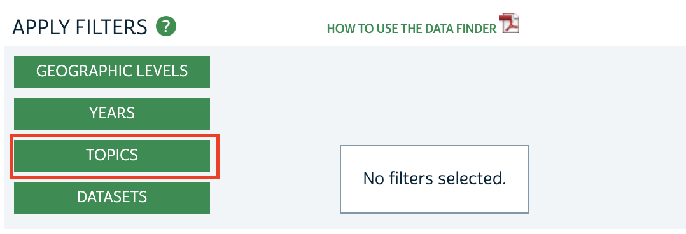

4. Select `Housing`.
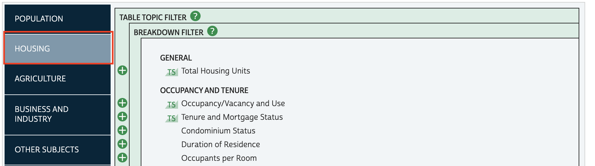

5. Check off `Tenure and Mortgage Status`.
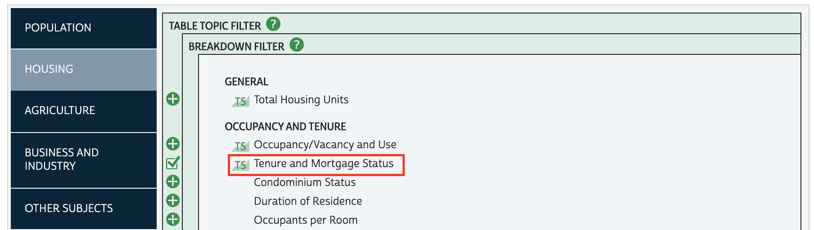

6. Finalize your topics selection by choosing the `Submit` button.
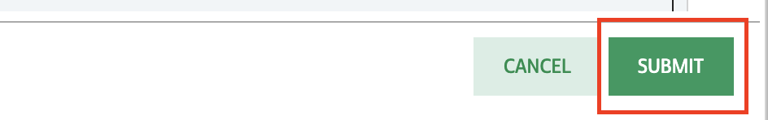

7. To specify we want to work with census tracts, select `Geographic Levels`.
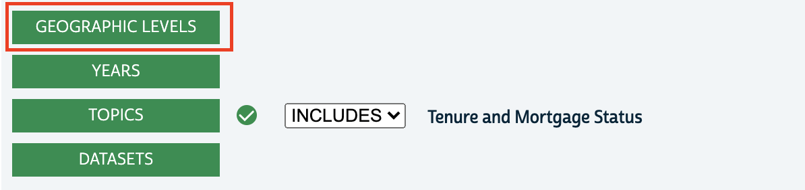

8. Check off `Census Tract`.
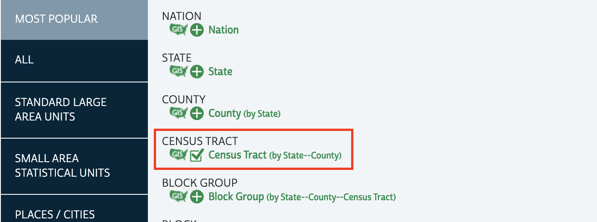

9. Finalize your geographic levels selection by choosing the `Submit` button.

10. To indicate our time frame of 2015-2019, select `Years`.
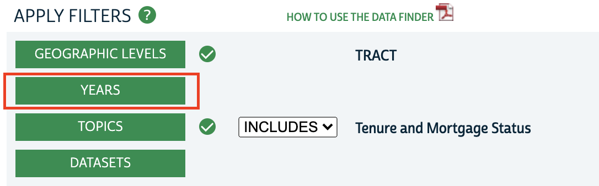

11. Check off `2015-2019`.
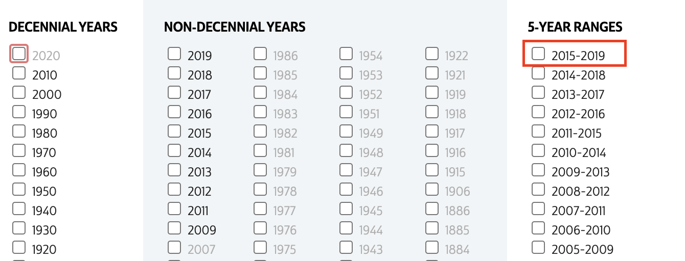

12. Finalize your years selection by choosing the `Submit` button.

13. Under `Source Tables`, check off the **Tenure** data table. This will add the census statistical table to our shopping cart.
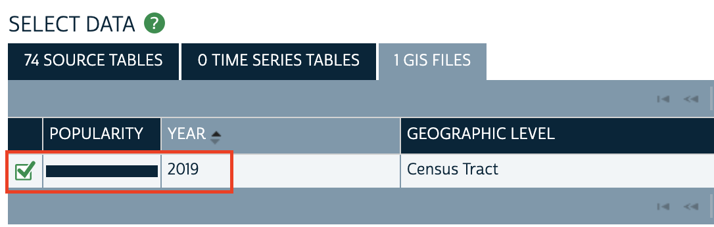

14. To change the results that match our criteria from **tables** to **GIS boundary files**, select `GIS Files`.
>Remember, we need both!
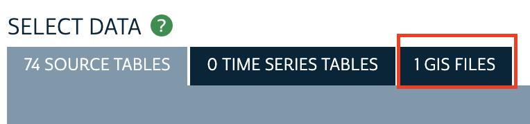

15. Checkout by selecting `Continue` from the data cart in the upper-right hand corner of the screen.
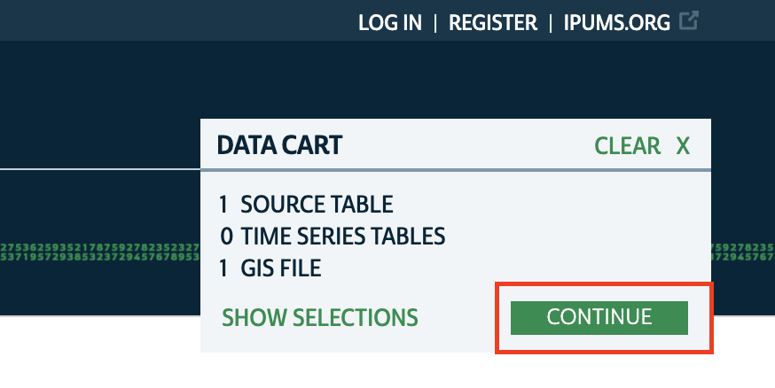

16. Accept all of the download defaults.

17. Select `Submit`.
> You will need to create a free login in order to checkout. You can create one in a new tab if you don't want to lose your data selection.

### Tips

- It takes a few minutes to prepare your extract. You can either wait and refresh the page, or you will receive an email when the data is ready.
- Extracts come with any accompanying codebook.
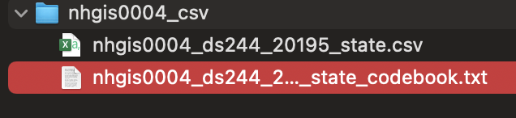
- Use this codebook to make sense of the table's field names.
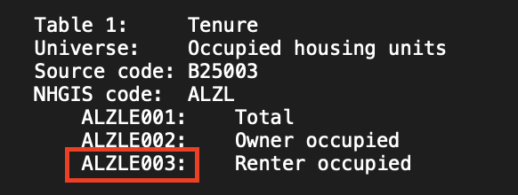

