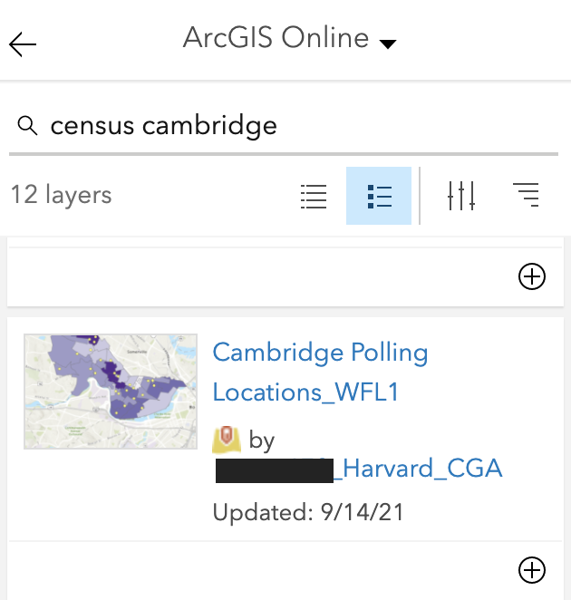
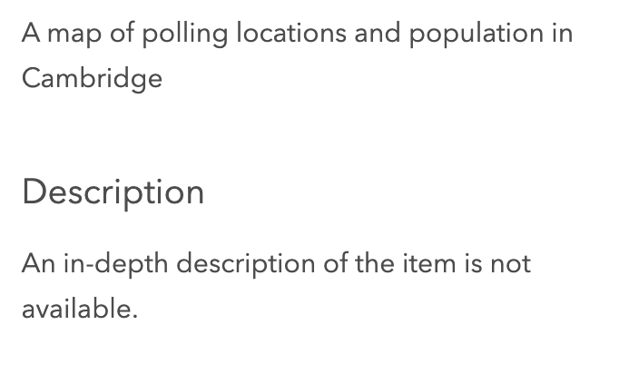

# Searching for data in ArcGIS Online

ArcGIS Online offers users the ability to search for datasets within their browser application. This guide will cover some common sandtraps with obtaining data this way.

## Anyone can publish data
When you search for datasets in ArcGIS Online, the results come back with any data published by any ArcGIS user. 

ArcGIS Online requires any user to tag data they have uploaded as `public` before being able to share a webmap. This means many users are incentivized to make datasets public, without requirements to share information about their own data practices. This makes the data hard to rely on.

Even in cases where you suspect the data is probably legitimate, a lack of avaiblable methodology means that it can be hard to use the data in your own research project.

For instance, here is a dataset made public by another Harvard researcher. When you search `Cambridge census` this dataset comes up.

While this researcher most likely processed their data using reliable best practices, there is no information available on how they processed the data behind the scenes. This could include where the data was acquired, how data columns were manipulated, combined, analyzed, etc. 

There is no documentation for this dataset.

To ensure your data is reliable for your research purposes, you should opt for obtaining data from the source, in this case the US census, and performing data cleaning practices yourself, though it is more time-consuming.

The ESRI Living Atlas is a growing repository of data sources aggregated by ESRI, the company who owns ArcGIS Online. In this repository, they allow users to filter datasets using the `authoritative` flag. Not sure what this actually means? Here is an p[ESRI-published StoryMap](https://storymaps.arcgis.com/stories/820980061e124d71b19c7bc124390bef) which provides information on how datasets are tagged as `authoritative`. You can use this StoryMap to decide if a datasets you find is suitable for your research purposes.

## You are limited to what other people have uploaded

In the example above, when we searched `Cambridge census`, we found a dataset for the `total population` for the city of Cambridge. What if we wanted to make a map of the percent of women, rather than total population? This dataset does not come up in our search results.

That is because when searching for data in ArcGIS, we are limited to the whim of what other people have happened to upload. 

Becoming comfortable with using data extract tools directly from the source will majorly increase your ability to make excellent maps. 

Our tutorial mini-series [Census Data to ArcGIS Online Starter Pack](https://harvardmapcollection.github.io/tutorials/census/census2agol/) will teach you step by step how to download the exact dataset you need directly from the source, clean it for your purposes, and upload to a sharable web map. 

