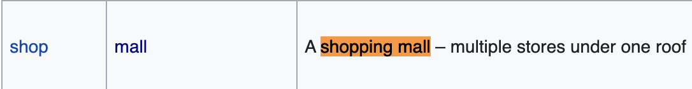
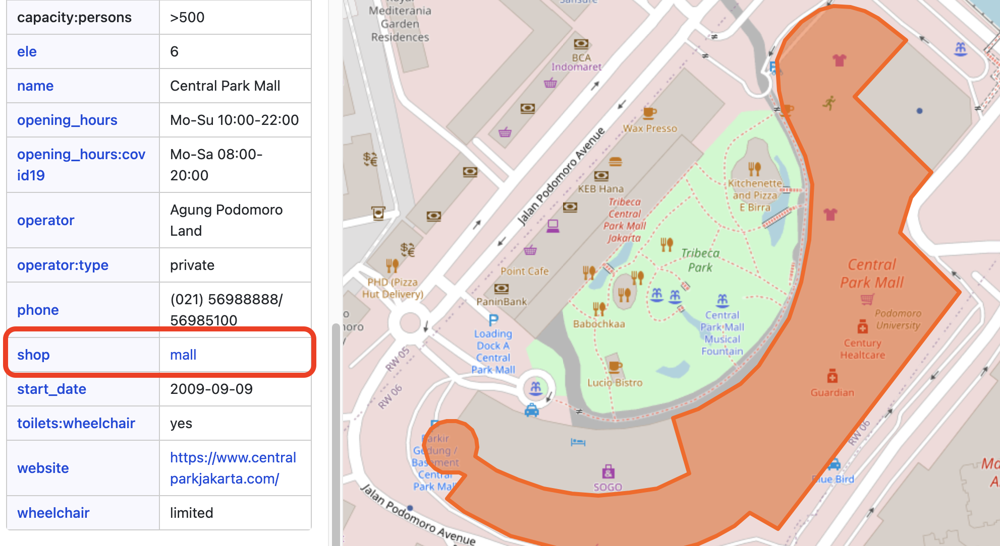
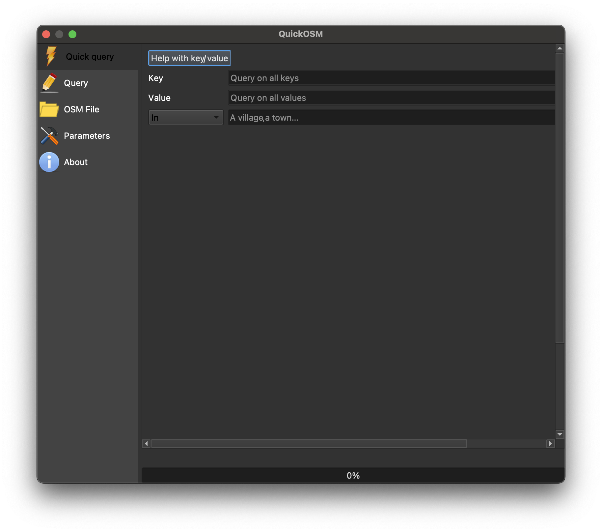

# Extract OpenStreetMap Data by Feature

In the [previous OpenStreetMap (OSM) tutorial](https://harvardmapcollection.github.io/tutorials/openstreetmap/how-to-extract-openstreetmap-data-layers/), we learned how to extract a standard set of map features from [OpenStreetMap](https://www.openstreetmap.org/) including waterways, buildings, general points of interest, and roads.

In this tutorial, we will learn how to specify by *type* of feature, and extract data within a particular extent for only that type of feature.

No programming is required for this tutorial; we will use only a [QGIS](https://harvardmapcollection.github.io/tutorials/qgis/download/) plugin called `QuickOSM`. 

## Data availability

The list of *types* of features you can export from OSM is impressive; you can view the full list on the [OpenStreetMap Map Features Wiki](https://wiki.openstreetmap.org/wiki/Map_features).

>[List of exportable features](https://wiki.openstreetmap.org/wiki/Map_features) from OSM.

## Limitations

It must be stated that because OpenStreetMap data is user contributed (think of OSM as the Wikipedia of maps), you can expect the data exports to be incomplete. The level of completeness depends on the happenstance of who added information for the types of features you are seeking. Still, in cases where no other known data source exists, OSM extracts can be a good place to start. 

## How it works

To best understand the data you will be exporting, it is helpful to consider how it is created. After making an account, any [OpenStreetMap (OSM)](https://www.openstreetmap.org/) user can open the OSM editor and add features (points, lines and polygons) for phenomena in the world. 

> The OSM editor.

There are standards for how data should be entered and tagged, but beyond basic geometry, qualitative information about each feature is optional. That means, for instance, in some cases a restaurant may be tagged with the specific kind of ethnic cuisine, while other times the `cuisine` key field might have a blank or null value.

> Example of tagging using the **amenity** key.

OSM defines standard ways for entering feature data, but sometimes people enter data incompletely or incorrectly.

## Query tips

For this reason, before using an export tool like the `QuickOSM` QGIS plugin we will use in this tutorial, it is helpful to do some research about how the features in question have been tagged in the area you are looking for. 

The first step is to consult the [OpenStreetMap Map Features Wiki](https://wiki.openstreetmap.org/wiki/Map_features) and identify how a feature is *supposed* to be tagged. For instance, if we are looking for shopping malls, we can find that the suggested key, value pair is `shop`, and `mall`, respectively.

> The recommended key, value pair for tagging shopping mall features in OSM is `shop`, and `mall`, respectively.

In practice, however, features can be tagged in all sorts of idiosyncratic ways. 

In this example, the contributor tagged the building correctly using the `shop` key with the `mall` value.

In this example, however, the contributor used the `building` tag and entered `mall` as the value.

Idiosyncracies like this are important to note, because, as we will see, queries are constructed by supplying the key value pair to the extract tool. If a significant number of the features you want are tagged differently than is outlined by the OSM standard, you will need to make note of that in your query building.

### Reverse search
We suggest, therefore, visiting [OpenStreetMap (OSM)](https://www.openstreetmap.org/#map=18/-6.22574/106.81122) first as a user and inspecting the attributes of a selection of your desired features to see how they are constructed. You can inspect the attributes by right-clicking an area on the map, selecting `Query features`, and clicking on the feature you are interested in. Note how the data is structured, and remember it for when you are building your query.

## How to export data

1. Download [QGIS](https://harvardmapcollection.github.io/tutorials/qgis/download/) if you haven't already.

2. In the main (top, horizontal) QGIS menu, select `Plugins`, then `Manage and Install Plugins`.

3. Search for `QuickOSM` and install the plugin.

4. Once installed, the plugin will appear under the `Vector` menu in the main QGIS menu. Select `Vector`, then `QuickOSM`, then `QuickOSM`.
> There are more advanced ways to build queries using this tool, but we are going to stick with the `QuickQuery`, which requires only the `key`, `value`, and `location`.

5. Input the following values:
> key: **shop**
value: **mall**
location: **Jakarta**

6. Select `Run query`

The tool will automatically render all available features as data layers in your QGIS document. Here we can see that there is both a point and polygon layer for malls.

If your query is returning no features, while it is possible that no features of that type have been contributed in the area you are searching, it is also highly likely you may need to construct your query differently. We suggest researching how your desired features have been tagged in OpenStreetMap, as outlined in the [reverse search](https://harvardmapcollection.github.io/tutorials/openstreetmap/extract-by-feature/#reverse-search) section above, and trying different queries where appropriate.

> Example alternate query
key: **building**
value: **mall**
location: **Jakarta** 

If a significant number of features have alternate tagging, you can export them separately and then later [merge the shapefiles](https://guides.library.duke.edu/QGIS/Merge) together to create one "complete" layer. 

It may be hard to see on this map below, but the key: `building`, value: `mall` query returned a not insignificant number of malls. 

Here is the attribute table for the results of this query, showing that it has returned thirty-three instances of malls in Jakarta.

To save the results as a new data layer, right-click the layer in the layer list and select `Export`. Choose `Save features as` and save the data someplace logical, naming the file and selecting `geoJSON` as the filetype. 
