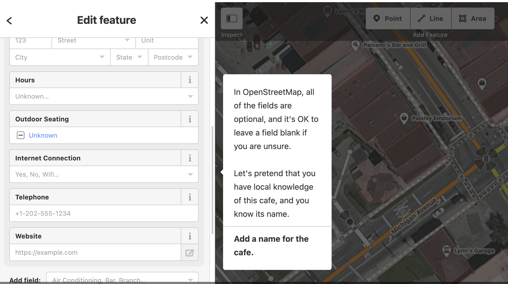
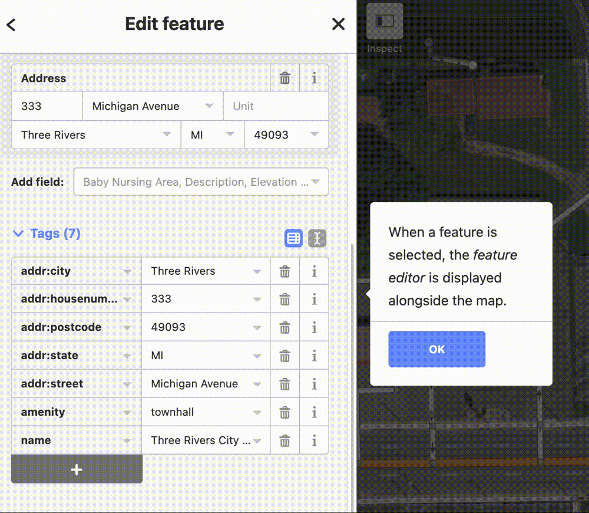
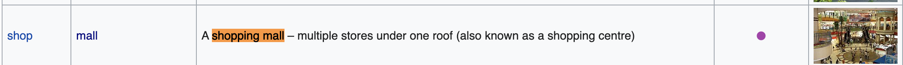

# Extract OpenStreetMap Data by Feature

In the [previous OSM tutorial](https://harvardmapcollection.github.io/tutorials/openstreetmap/how-to-extract-openstreetmap-data-layers/), we learned how to extract a standard set of map features from [OpenStreetMap (OSM)](https://www.openstreetmap.org/) including waterways, buildings, general points of interest, and roads.

In this tutorial, we will learn how to specify a specific *type* of feature, and extract data within a particular extent for only that type of feature.

No programming is required for this tutorial; we will use only a [QGIS](https://harvardmapcollection.github.io/tutorials/qgis/download/) plugin called `QuickOSM`. 

## Data availability

The list of *types* of features you can export from OSM is impressive; you can view the full list on the [OpenStreetMap Map Features Wiki](https://wiki.openstreetmap.org/wiki/Map_features).

>[List of exportable features](https://wiki.openstreetmap.org/wiki/Map_features) from OSM.

## Limitations

It must be stated that because OpenStreetMap data is user contributed (think of OSM as the Wikipedia of maps), you can expect the data exports to be incomplete. The level of completeness depends on the happenstance of who added information for the types of features you are seeking. Still, in cases where no other known data source exists, OSM extracts can be a good place to start. 

## How it works

To best understand the data you will be exporting, it is helpful to consider how it is created. After making an account, any [OpenStreetMap (OSM)](https://www.openstreetmap.org/) user can open the OSM editor and add features (points, lines and polygons) for phenomena in the world. 

> The OSM editor.

There are standards for how data should be entered and tagged, but beyond basic geometry, qualitative information about each feature is optional. That means, for instance, in some cases a restaurant may have a tag with the kind of ethnic cuisine, and other times the `cuisine` type field will have a blank or null value.

There are suggested ways to enter or tag data, but people don't always enter the full extent of information you might be looking for.

> Example of tagging using the **amenity** key.

## Query tips

For these reasons, before using an export tool like the `QuickOSM` QGIS plugin we will use in this tutorial, it is helpful to do some research about how the features in question have been tagged in the area you are looking for. 

The first step is to consult the [OpenStreetMap Map Features Wiki](https://wiki.openstreetmap.org/wiki/Map_features) and identify how a feature is *supposed* to be tagged. For instance, if we are looking for shopping malls, we can find that 

>

## How to export data

