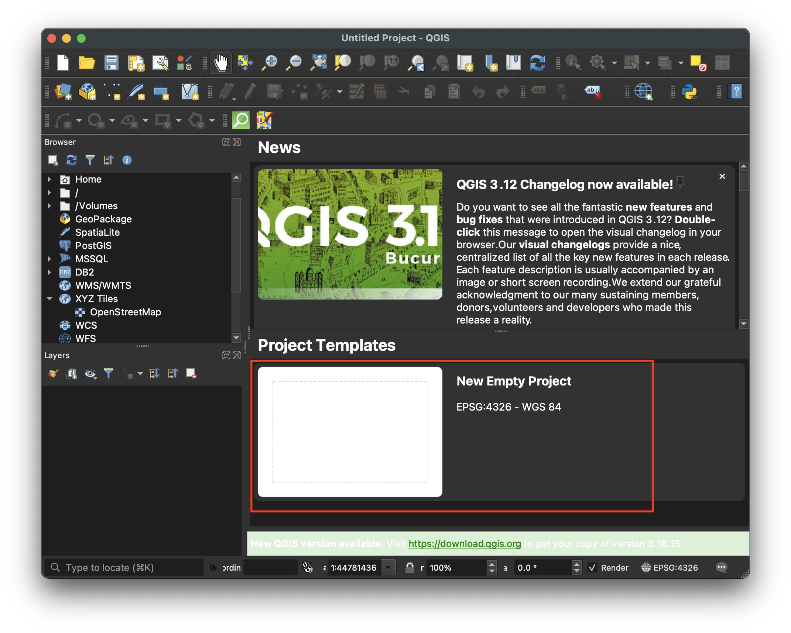

# How to Add a Basemap to a QGIS Project

Basemaps can be helpful reference points when working with spatial data. 

## How to add a basemap to your project

1. Open a new QGIS project.

2. In the left-hand browser menu, locate `XYZ Tiles → OpenStreetMap`
> OpenStreetMap base tiles are built in to QGIS.

3. Drag `OpenStreetMap` into the `Map Canvas`

4. Zoom in to the desired location by selecting the `Zoom In` menu item, and clicking and dragging on the `Map Canvas`

## Tips
- To add other styles of basemap not included by default in the QGIS install, you can run a Google search about the latest QGIS plugins for basemaps. Here is a [2018 article about using basemap plugin Quick Map Services](https://opengislab.com/blog/2018/4/15/add-basemaps-in-qgis-30) for additional basemap styles.