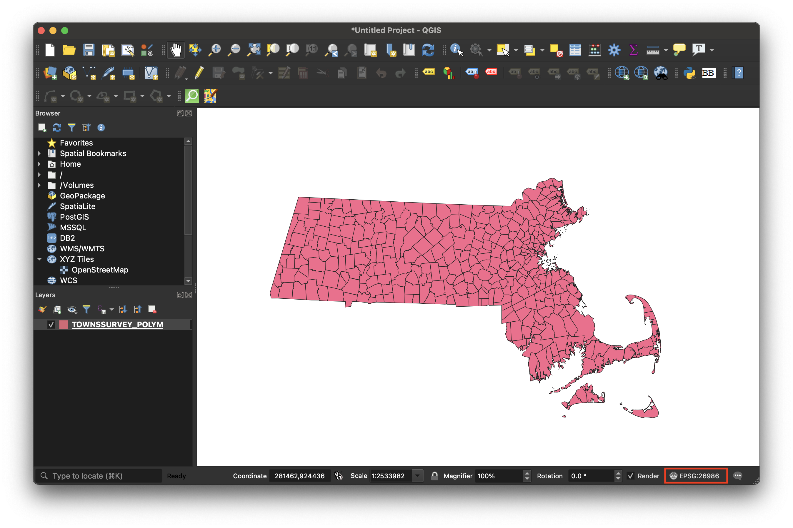
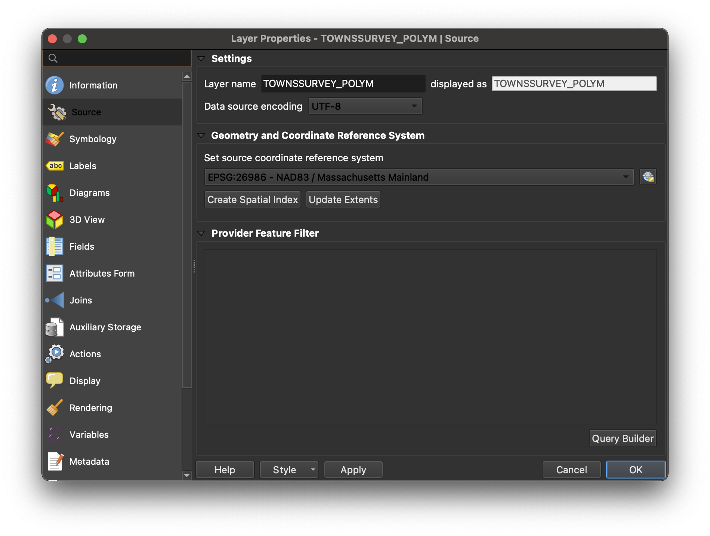

# How to change a datasets CRS in QGIS

In order to use multiple datasets together for visualization and analysis, it is often important that each dataset is saved in the same coordinate reference system (CRS).

## Concepts

"Map projections try to portray the surface of the earth, or a portion of the earth, on a flat piece of paper or computer screen. In layman’s term, map projections try to transform the earth from its spherical shape (3D) to a planar shape (2D).

A coordinate reference system (CRS) then defines how the two-dimensional, projected map in your GIS relates to real places on the earth. The decision of which map projection and CRS to use depends on the regional extent of the area you want to work in, on the analysis you want to do, and often on the availability of data." - *[QGIS documentation](https://docs.qgis.org/3.16/en/docs/gentle_gis_introduction/coordinate_reference_systems.html)*

## Importance

Every mapmaker at one point or another has been frustrated by their data layers not lining up on the map, or map data appearing in the middle of the ocean instead of where it is supposed to be. This can almost always be chalked up to data being in the wrong CRS.

There are many resources available on [how to choose a map projection](http://www.geo.hunter.cuny.edu/~jochen/gtech201/lectures/lec6concepts/map%20coordinate%20systems/how%20to%20choose%20a%20projection.htm#:~:text=When%20you%20choose%20a%20projection,area%E2%80%94to%20achieve%20that%20purpose.).

In this tutorial, you will learn a straightforward, practical way to make sure all datasets are in the same CRS so you can get started mapping.

## How to change a dataset's CRS

1. Note the project's current CRS by checking the bottom right of the map document interface.

The example data was obtained from MassGIS, the open data portal for Massachusetts. The creators used CRS `NAD83 | Massachusetts Mainland`. The code for this CRS is `EPSG: 26986`. QGIS defaults the project CRS to that of the first dataset added to the map document.

2. In the bottom-right of the QGIS window, click the button that says `EPSG: some numerical code`.

3. An interface will pop up prompting us to select the CRS for the whole project. Select `WGS 84 EPSG: 4326`. If you can't find it in the menu, you can search for it next to the `Filter` box.

4. Select `OK`.
> You'll notice the look of your data may change when you change the project CRS. If cartography is your primary concern, you should pick a reference system that matches the location you are mapping. If you aren't sure, or want to ensure your data will work with all web mapping applications, you can default to `WGS 84 EPSG: 4326`.

5. We just changed the CRS for the project. That is different than changing the CRS of the *data layer*. Each GIS dataset has its own CRS. To find out the dataset's CRS, right-click on the data layer in the layer-list, and select `Properties`.

6. From the menu, select `Source`.

7. Even though we changed the project CRS, the data layer's source CRS is still `EPSG: 26986 NAD83 / Massachusetts Mainlaind`. To change it, under `Set source coordinate reference system` you can use the dropdown to recent choices, or click the globe icon to bring up the CRS search interface. Pick `WGS 84 EPSG: 4326`.

8. Select `OK`.

9. It is likely that when you changed the data source CRS, the location of the data in context to your project frame shifted out of view. To center your data on the map again, you can [zoom to layer](https://harvardmapcollection.github.io/tutorials/qgis/zoom-to-layer).

10. A good rule of thumb when making changes to data inside of a GIS desktop software is to assume that the changes are ephemeral until you export the data as a new dataset. To save this dataset's new source CRS, right-click the data layer in the layer list, and select `Export → Save Features As`. 

11. Make sure you are saving with the correct CRS, as well as saving to a folder you will remember. Select `OK`. 

12. If you had been experiencing problems perfoming analysis, getting errors you suspect could be related to inconsistent CRS across layers, try running the tools again with the newly exported dataset. 