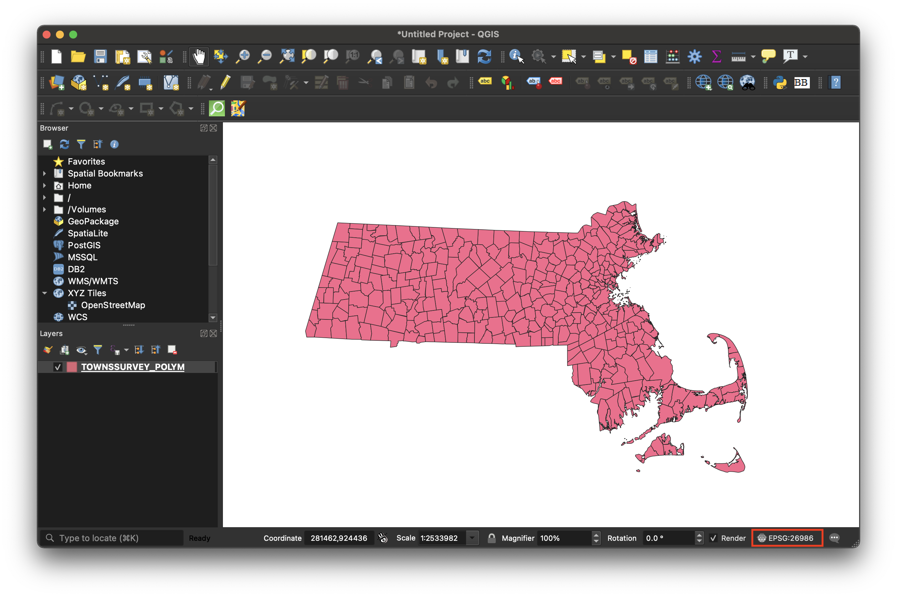

# How to change a datasets CRS in QGIS

In order to use multiple datasets together for visualization and analysis, it is often important that each dataset is saved in the same coordinate reference system (CRS).

"Map projections try to portray the surface of the earth, or a portion of the earth, on a flat piece of paper or computer screen. In layman’s term, map projections try to transform the earth from its spherical shape (3D) to a planar shape (2D).

A coordinate reference system (CRS) then defines how the two-dimensional, projected map in your GIS relates to real places on the earth. The decision of which map projection and CRS to use depends on the regional extent of the area you want to work in, on the analysis you want to do, and often on the availability of data." - *[QGIS documentation](https://docs.qgis.org/3.16/en/docs/gentle_gis_introduction/coordinate_reference_systems.html)*

Every mapmaker at one point or another has been frustrated by their various datasets not lining up, or map data appearing in the middle of the ocean instead of where it is supposed to be. This can almost always be chalked up to data being in the wrong CRS.

In this tutorial, you will learn the easiest practical way to make sure all datasets are in the same CRS and playing nicely with one another.

1. Note the project's current CRS by checking the bottom right of the map document interface.
