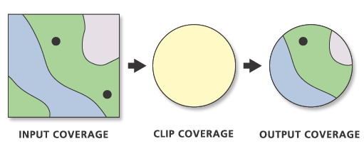
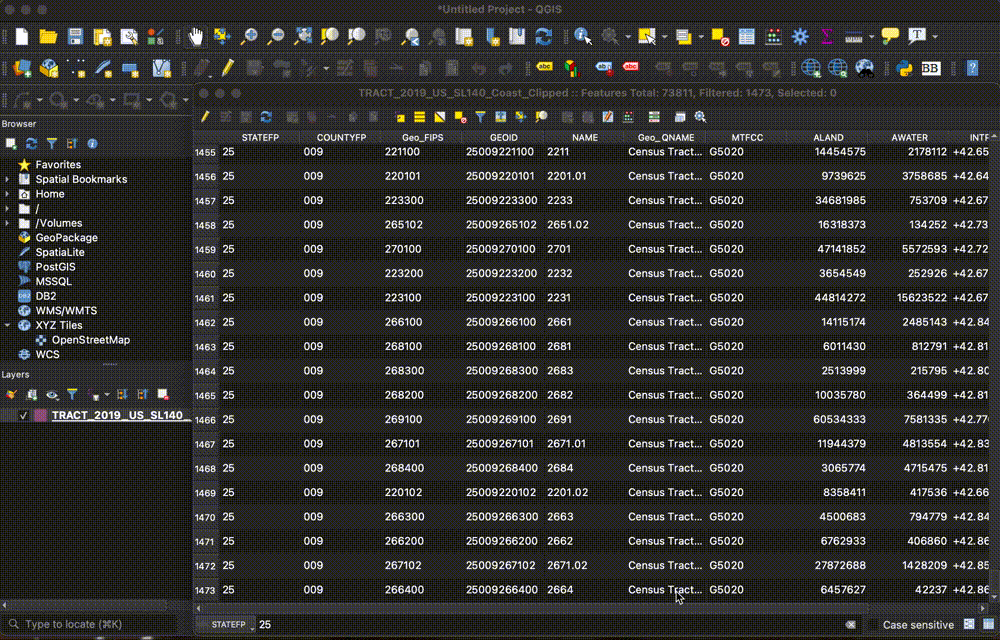
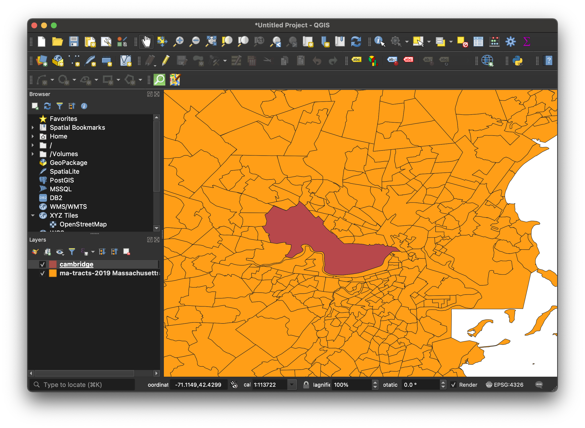
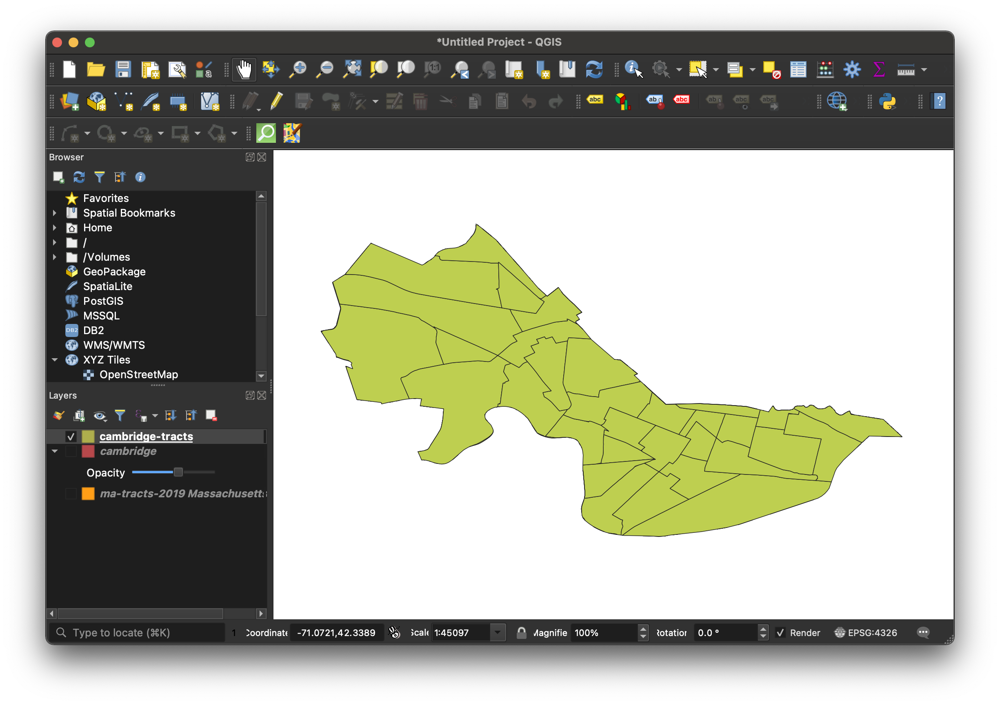

# How to clip GIS data

Clipping is a way of cropping GIS data to a certain extent. 

> From [ESRI documentation on clipping](https://desktop.arcgis.com/en/arcmap/10.3/tools/coverage-toolbox/clip.htm). 

## Why do we clip?
- Larger datasets are more unwieldy and difficult to work with.
- You can create more effective visualizations if your data is focused.

## Tutorial data

In this tutorial you will clip a shapefile of all census tracts in the United States to create a new shapefile of *only* census tracts in Cambridge, Massachusetts. 

#### United States Census tracts
This is the large dataset that needs to be *clipped*. 
- [Learn how to get](https://harvardmapcollection.github.io/tutorials/census/obtaining-census-data/)
- [Download](https://geodata.socialexplorer.com/collection/90937129-3414-434e-a880-e358308654b4) 
    - **Tip:** Select the 2019 option.

#### Boundary of Cambridge, MA
This is the the desired extent dataset used to *clip with*.
- [Learn how to get](https://harvardmapcollection.github.io/tutorials/qgis/export-selected/)
- [Download](https://raw.githubusercontent.com/HarvardMapCollection/tutorials/main/sample-data/cambridge.geojson)
    - **Tip:** Right-click anywhere on the screen and select `Save As`.

## Clip by attribute

Before we clip by geography, let's first extract only census tracts in the state of Massachsuetts. This will make our data much easier to work with, and will make the clipping processes run faster.

1. Open [QGIS](https://harvardmapcollection.github.io/tutorials/qgis/download/). 

2. Add the tracts file to QGIS. To learn how to add vector files to a desktop GIS program, follow [these steps](https://harvardmapcollection.github.io/tutorials/qgis/open-vector/). 

3. Open the dataset's attribute table by right-clicking the tracts layer in the layer list, and selecting `Open Attribute Table`.

> Filter the table to only show records that have a [state FIPS code](https://www.nrcs.usda.gov/wps/portal/nrcs/detail/?cid=nrcs143_013696) of 25, the Massachusetts state FIPS code. 
4. In the bottom-right hand corner click `Show All Features`. 

5. Select `Field Filter → STATEFP`.

6. In the search box to the right of `STATEFP` type in `25`. 

7. Press the `enter key`. It will take a long time to return results because there are so many records to search through. 

8. Highlight all of the records in the table by clicking to the left of a row to highlight it, then holding the shift key, and selecting the rest. 
> Any feature you have selected will appear yellow on the map to indicate it is highlighted. All of Massachusetts should be highlighted. 

9. To save just the Massachusetts tracts as a new file, right click on the tracts layer in the layer list and select `Export → Save Selected Features As`.

10. You can accept all defaults, but you need to save the dataset somewhere you will remember by clicking the ellipses (…) button next to file name and naming the file. After you enter a file name, your path should look something like this ...Downloads/Massachusetts-tracts.geojson.

11. Select Okay.

12. Your new dataset will be automatically added to the map. You can free up space by removing the original nation-wide tracts dataset. Do this by right-clicking the U.S. Tracts layer and selecting `Remove layer`.

## Clip by geography

1. Set up your QGIS project so that the layer list contains:
- Census tracts in the state of Massachusetts
- The boundary of the municipality of Cambridge
> If you have been skimming these guides and need the data files you can download MA tracts [here](https://github.com/HarvardMapCollection/tutorials/blob/main/sample-data/ma-tracts-2019.geojson), and Cambridge's boundary [here](https://raw.githubusercontent.com/HarvardMapCollection/tutorials/main/sample-data/cambridge.geojson). Right-click anywhere on the screen and select `Save As`.

2. Check to make sure your project looks something like this:

3. Add an opacity slider to the Cambridge boundary layer by following the steps in [this tutorial](https://harvardmapcollection.github.io/tutorials/qgis/adjust-opacity/). Use this to "peer under" the Cambridge boundary data and inspect the tracts we will be isolating via the geographic clip.

4. In the main QGIS menu (banner across the top of the computer screen), select `Vector → Geoprocessing Tools → Clip`. 

5. Input layer is MA tracts. Overlay layer is Cambridge.
> **Input:** Data you want to clip
**Output:** Clipping boundary (new extent you want to clip *by*)

6. Under `Clipped` select the ellipes three dots icon, pick `Save to file`, and save the new clipped layer somewhere you will remember. You can title the file `Cambridge-tracts`, and save it as either a `shapefile` or `geoJSON`. 
>**Tip:** We prefer [GeoJSON](https://geojson.org/) because it is an open standard, and is only one file instead of six. 

7. Select `Save`.

8. Select `Run`.

9. The new dataset is automatically added to the map. You can toggle off the original two layers in the layer list to make sure your new dataset looks correct.

>**Tip:** Any geoprocessing functions can fail if data layers are set in different coordinate reference systems. If you suspect this might be a problem, you can follow the steps in [this tutorial](https://harvardmapcollection.github.io/tutorials/qgis/change-crs/). 

