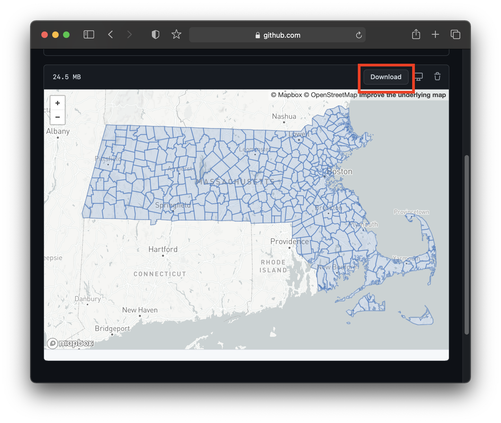

## How to export selected features in QGIS

One helpful technique in GIS software is the ability to quickly create filtered subsets of an original data source. You may want a new dataset that only contains features of a certain type (e.g. only water bodies of a certain depth). Alternatively, you may want to select features based on their location.

In this tutorial, we will start with a dataset of all 351 towns in Massachusetts, and create a new dataset that only shows the boundary of Cambridge, MA. 

1. Download the example dataset [here](https://github.com/HarvardMapCollection/tutorials/blob/main/sample-data/ma-towns.geojson) and clicking the `Download` button.

2. Add the downloaded vector polygon geojson to QGIS by following the steps in [this tutorial]().