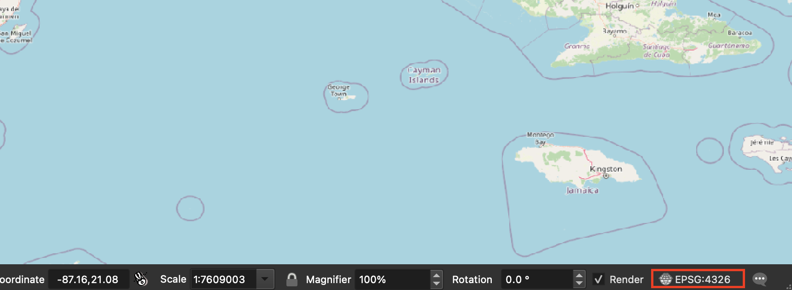

# How to Georeference in QGIS

1. [Download QGIS](https://harvardmapcollection.github.io/tutorials/qgis/download/), if you haven't already.

2. [Add a basemap](https://harvardmapcollection.github.io/tutorials/qgis/add-a-basemap/) `Browser → XYZ Tiles → Open Street Map`.

3. Set the project projection to WGS 84. At all times in the bottom right of the QGIS document, EPSG should read 4326.
> You can use another projection that fits with your project data, but selecting 4326 will ensure the maps are compatible with any webmapping project, especially those using Leaflet.

4. Open `Raster → Georeferencer`. 
>The Georeferencing plugin comes automatically installed with recent versions of QGIS. If you do not see it, it is because it has not been enabled. To enable: navigate to `Plugins → Manage & Install Plugins → Installed` and make sure the box next to Georeferencer GDAL is checked.

5. Open the image you wish to georeference in the georeferencer, by clicking the blue checkered `Open Raster` icon in the menu banner.

6. After you have added an image to the GDAL Georeferencer, click the `Add Point` button in the menu banner.

7. Choose a spot on the historical map for which you think you can find a corresponding modern location. Street intersections are a good place to start, if they still exist!

8. Choose to add the corresponding location `From Map Canvas`.

9. Find the location on the modern map.

10. Click `OK` on the Enter Map Coordinates dialog box. In the GDAL Georeferencer, the map will not automatically snap to the correct location. Preview is not available until a few points have been added.

11. Add two more control points, so that there are three total, attempting to spread the gcps on opposite corners of the map.

12. When there are three points, click the green `Start Georeferencing` button.

13. The transformation settings will open. Select the following options:
> Transformation type: **Polynomial 1**  
Resampling method: **Cubic**  
Target SRS: **EPSG: 4326 - WGS 84**  
Output Raster: **Save somewhere you will remember with a unique ID**  
Compression: **LZW**  
Save GCP points: **Checked**  
Load in QGIS when done: **Checked**  
**Everything else unchecked**  

14. Click the green `Start Georeferencing` button again. A progress bar will appear.

15. The new file will be added to the QGIS document. Look at it closely to make sure everything is lining up properly.

16. To make adjustments to the georeferencing, add more control points, or delete points that are incorrect, return to the GDAL Georeferencer window:
> Use the GCP table to view error for gcps. Delete incorrect points by highlighting the row and right-clicking.
When new points are added or changes are made, click the green Start Georeferencing arrow again to update the geoTIFF. The updated image will be added to the map document.

17. Make sure that the file exported has the correct name and saved properly to where you are organizing your data.

18. When the final image file has been georeferenced in a satisfactory manner and exported, navigate to the folder where it's saved. Open the .txt file in a text editor to ensure that the points are saving correctly.
> Saving control points ensures that your georeferencing efforts are backed up. 
If, for some reason, they did not export correctly, it is possible to export them by navigating back into the GDAL Georeferencer window and selecting `File → Save GCP points as ... `

19. The best way to check for image quality is to open the new geoTIFF in a photo editing software, preferably [Photoshop](https://harvard.service-now.com/ithelp?id=kb_article&sys_id=9f3244d3dba304d430ed1dca489619e0). 
> Some source image files have bit depths that are incompatible with georeferencing, and sometimes transformation settings can cause loss. Inspecting in Photoshop is a good way to check quality.

20. To start georeferencing another map, in the QGIS georeferencer, select `File → Reset Georeferencer`. Repeat this process starting at step 5.

