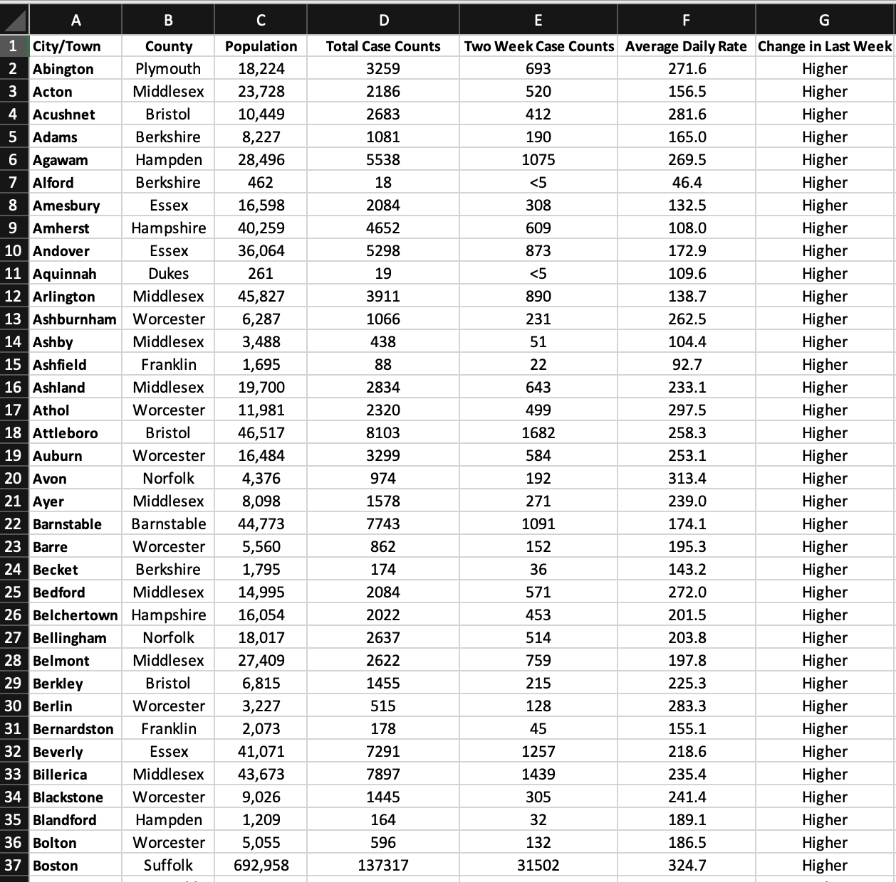
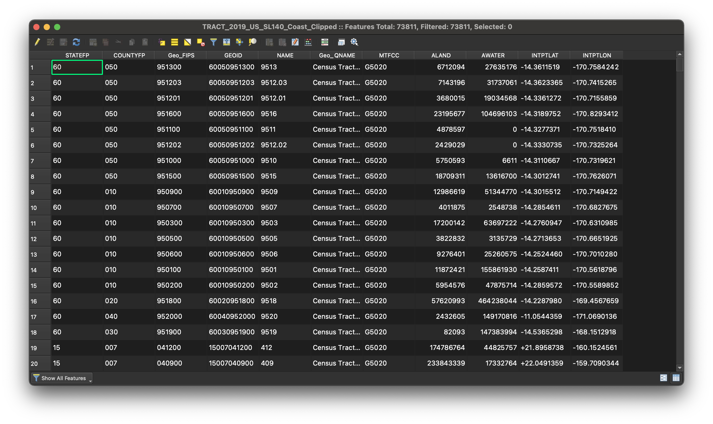
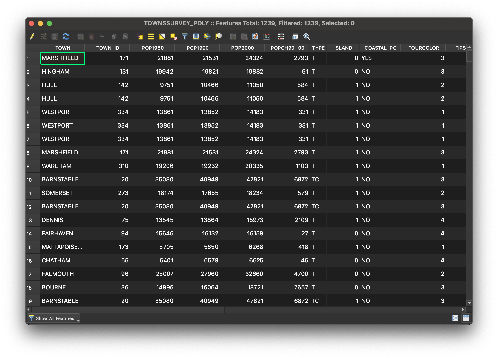
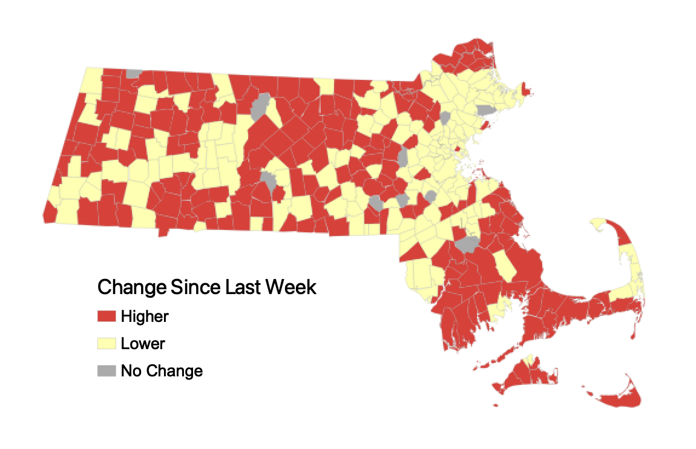
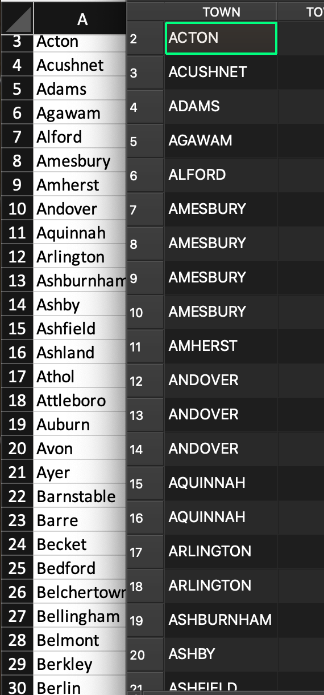

Under development! Coming soon!

# How to Join Data in QGIS

It is common for mappers to find information with a spatial component available in formats that are not yet optimized to work with mapping software. One such occurrence is working with spreadsheet data. 

In this tutorial you will learn how to join **tables** to **GIS shapefiles** to create a new, mappable dataset with both geographic boundaries *and* statistical information.

## Why do we join?

Often, spreadsheets contain useful information we want to map. GIS software, however, does not know how to translate a spreadsheet without any *inherent spatial information* (such as point coordinates) into a visual map.

Take, for instance, [this spreadsheet](https://www.mass.gov/info-details/archive-of-covid-19-cases-in-massachusetts) of weekly COVID rates for each town in Massachusetts for the week of January 26, 2022. 

Despite the obvious role of geography in this data (the data is arranged by town), if we were to bring this spreadsheet into a GIS program, the program would not know (without being told by us) which column to interpret as the "geography" to display visually. The formats `.csv` or `.xlsx` are not inherently spatial data formats. 

On the other hand, take this Massachusetts municipalities dataset which we downloaded from the state government's open data portal and opened up in a desktop mapping software. The data comes available as a `shapefile`, which is an inherently geospatial format.

Because this data is spatial, GIS software can recognize it, and automatically make a map out of it. 

The image above shows how mapping software *displays* GIS data, but what does the "data" actually look like? Let's look at the data's underlying `attribute table`.

Here, we can see that for each row, which represents a single GIS `feature` (in this case, a town), there are some basic facts (each column) about that town. Included here are town name, town ID, population count, etc.

Besides this basic information and the GIS feature shapes, this dataset is not entirely useful for mapping any meaningful statistics. 

 

Most of the time, the information we *want* to map, such as our example COVID rates, are not made available as shapefiles. They are created and distributed as spreadsheets, and in order to map them, we must join the spreadsheet together with GIS shapefile data using a GIS software like [QGIS](https://harvardmapcollection.github.io/tutorials/qgis/download/).

_Map of weekly Massachusetts COVID data spreadsheet from January 26, 2022, after being joined to a [Massachusetts municipalities shapefile](https://www.mass.gov/info-details/massgis-data-municipalities) from MassGIS._

## How do joins work?

In this tutorial, we will walk step-by-step through performing a join in QGIS. This tutorial is part of a series called the [Census Data to ArcGIS Online Starter Pack](https://harvardmapcollection.github.io/tutorials/census/census2agol/), but you can also use this guide separately to learn about joins.

Before we dive in to step-by-step instructions, however, let's go over the basic concept of **how joins work**.

To perform a join, you must have a column in each dataset which contains the same values.

For instance, when we joined the COVID spreadsheet to the Massachusetts municipalities shapefile, we joined on the common column of `town name`.

### Sandtrap!

An incredibly important tip to know about joins is that in order for the join to stick, values must match literally.

For instance, when we first tried to perfom the COVID data and town shapefile join, our join failed. 

Why did our join fail? Check out how the town names were formatted in each table's town column.

In the spreadsheet, towns are entered with camel case, whereas in the Massachusetts municipality data, the town name values are uppercase. In order to get this join to stick, we needed to clean up one of the datasets to make the two columns match identically.

## Tutorial with census data

>If you don't already have the data materials, you can either:
1. Follow the [Census Data to ArcGIS Online Starter Pack Series](https://harvardmapcollection.github.io/tutorials/census/census2agol/) to obtain them.
2. Download them here.

