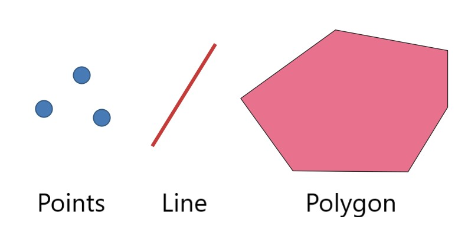
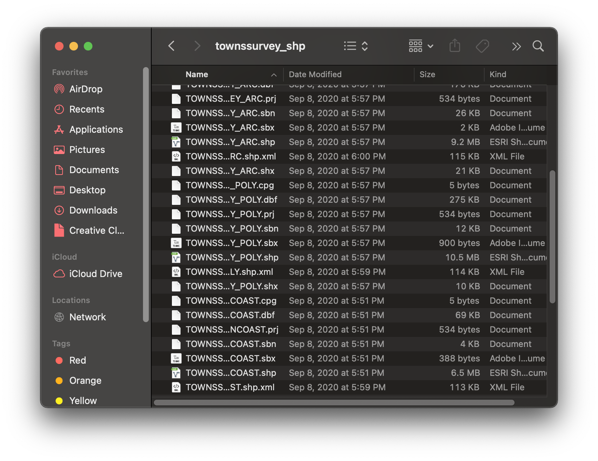
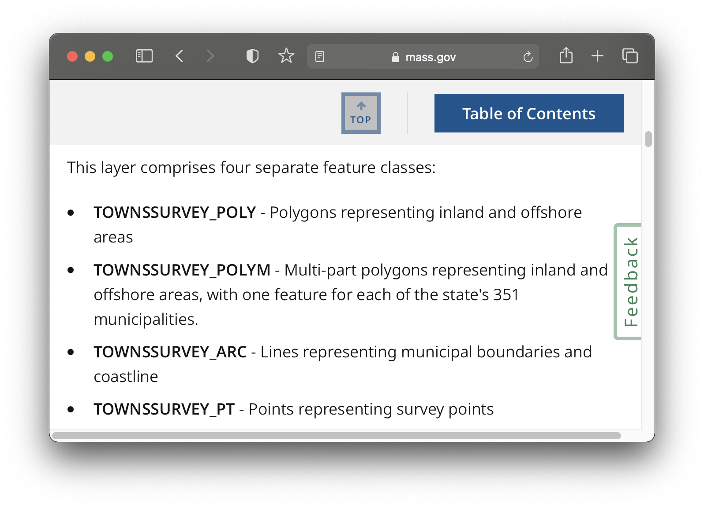

# How to Open Vector Data in QGIS

A predominant spatial data format is the **shapefile**. This is a format created for storing vector data.

Vector data consists of:
- points (e.g. landmarks)
- lines (e.g. roads, rivers)
- polygons (e.g. towns, bodies of water)

Since the advent of geospatial technology, **shapefiles** have been the most common format for storing vector information. Today, other file formats exist for storing vector information, such as the **geopackage (.gpkg)**, or **geoJSON (.geoJSON)**, but shapefiles are still widely used, and many of the datasets you will encounter will come in this format.

## Steps

> To download example data, follow the steps in [How to search for local boundary files](https://harvardmapcollection.github.io/tutorials/data/local-boundaries).
The following steps, however, can be applied to any shapefile. 

1. Inspect the data you have downloaded. 
> Shapefiles can be confusing because they contain multiple different files, each with a [different file extension](https://desktop.arcgis.com/en/arcmap/10.3/manage-data/shapefiles/shapefile-file-extensions.htm). All of these files with a common root filename are interpreted by GIS software as **one shapefile**.

2. The MassGIS towns download comes with many different shapefiles. To make sense of which one you should use for mapping town outlines, consult the [MassGIS metadata](https://www.mass.gov/info-details/massgis-data-municipalities).

3. Open QGIS. If you haven't downloaded it yet, you can [do so here](https://harvardmapcollection.github.io/tutorials/qgis/download/).

4. 